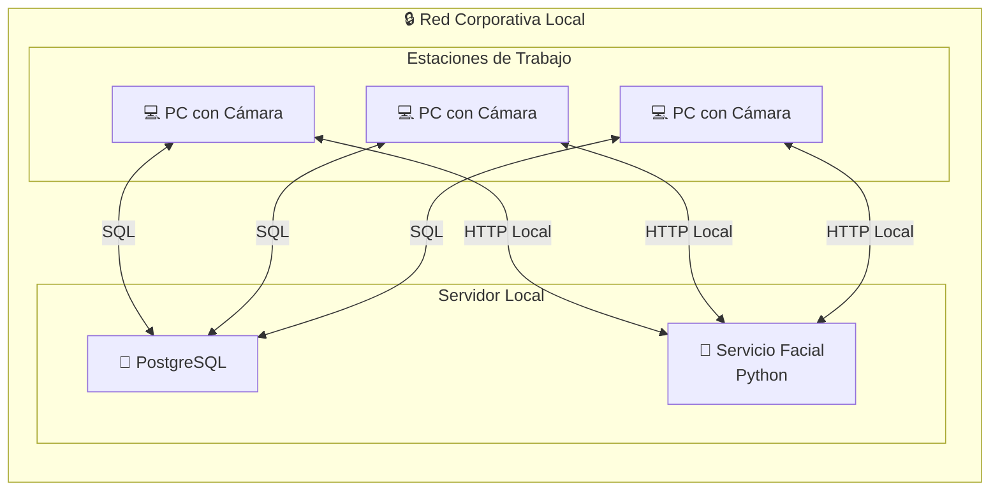
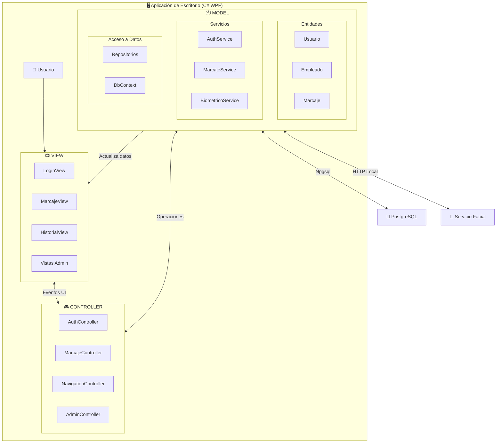
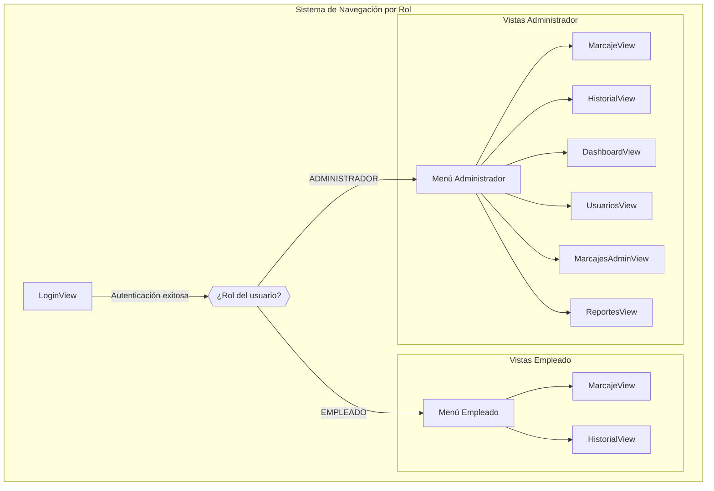
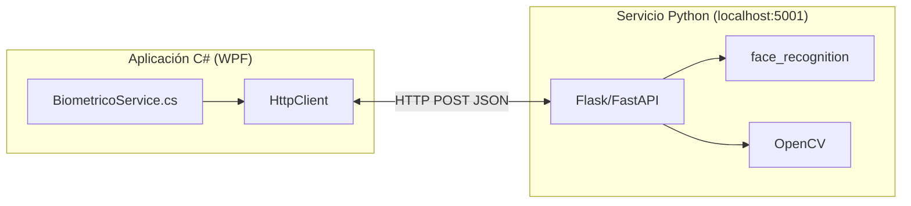
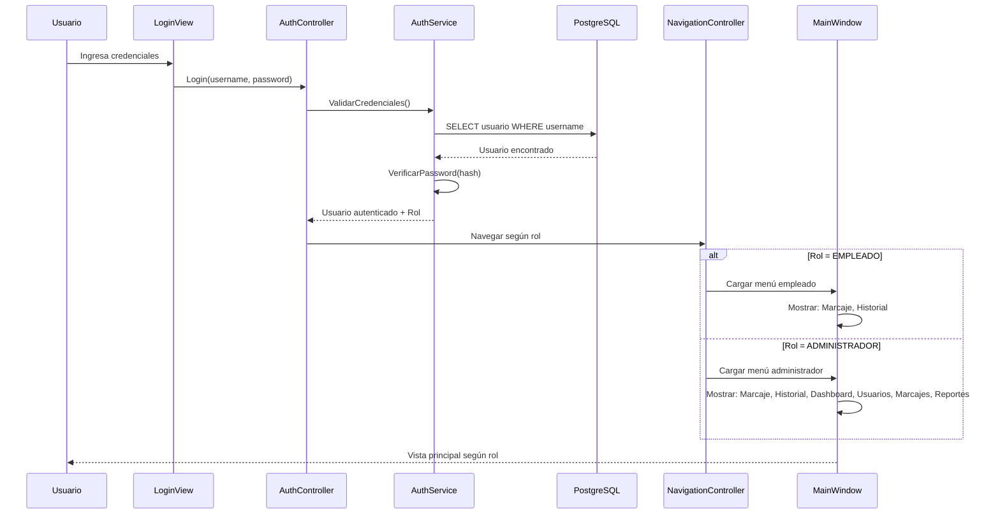
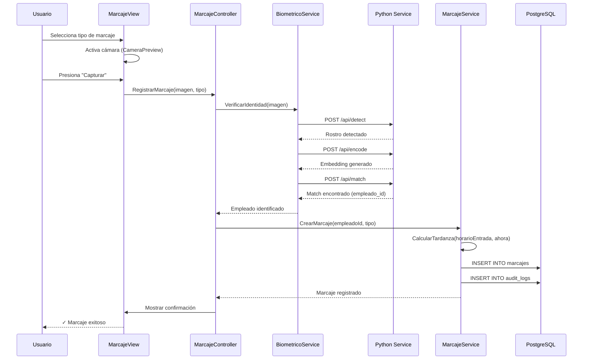

# Arquitectura Final — Sistema de Control de Asistencia Local

## MVC Desktop | C# + PostgreSQL + Python (Reconocimiento Facial)

> [!IMPORTANT]
> **DOCUMENTO DE PLANIFICACIÓN**
> Este documento describe la arquitectura propuesta para el sistema. No representa implementación de código, únicamente sirve como guía técnica para la fase de desarrollo.

---

## Resumen Ejecutivo

El **Sistema de Control de Asistencia con Reconocimiento Facial** es una aplicación de escritorio local diseñada para registrar y gestionar la asistencia de empleados en entornos corporativos. Opera exclusivamente dentro de la **red local** de la empresa, sin dependencia de servicios externos.

### Modelo de Operación



> [!IMPORTANT]
> **Todas las estaciones de trabajo ejecutan la misma aplicación.** Al iniciar sesión, el sistema identifica el **rol del usuario** (Empleado o Administrador) y adapta dinámicamente las **vistas y opciones disponibles** según sus permisos. No existe distinción de hardware entre "PC de empleado" y "PC de administrador".

### Diferenciación por Rol

| Rol | Acceso al Sistema | Vistas Disponibles |
|-----|-------------------|-------------------|
| **Empleado** | Cualquier PC con la app instalada | Marcaje, Historial personal |
| **Administrador** | Cualquier PC con la app instalada | Marcaje, Historial, Dashboard, Gestión de usuarios, Edición de marcajes, Reportes |

---

## Arquitectura MVC

El sistema implementa el patrón **Model-View-Controller (MVC)** para aplicaciones de escritorio, donde:

- **Model**: Contiene la lógica de negocio, entidades y acceso a datos
- **View**: Interfaces gráficas WPF (XAML) que el usuario visualiza e interactúa
- **Controller**: Coordinadores que manejan eventos de usuario y orquestan Model y View



---

## Stack Tecnológico

| Capa | Tecnología | Versión | Propósito |
|------|------------|---------|-----------|
| **Lenguaje Principal** | C# | 12 (.NET 8) | Desarrollo de la aplicación |
| **Framework GUI** | WPF | .NET 8 | Interfaz de usuario desktop |
| **Base de Datos** | PostgreSQL | 16 | Almacenamiento persistente |
| **ORM** | Entity Framework Core | 8.x | Mapeo objeto-relacional |
| **Driver BD** | Npgsql | 8.x | Conexión a PostgreSQL |
| **Reconocimiento Facial** | Python + OpenCV + face_recognition | 3.11+ | Procesamiento biométrico |
| **Comunicación Python** | Flask/FastAPI | - | API REST local para facial |
| **IDE** | Visual Studio 2022 | - | Desarrollo C# |
| **Control de Versiones** | Git + GitHub | - | Gestión de código |

---

## Estructura del Proyecto

```
/AttendanceSystem/
├── AttendanceSystem.sln                      # Solución Visual Studio
│
├── src/
│   │
│   ├── AttendanceSystem.App/                 # 🖥️ PROYECTO PRINCIPAL (WPF)
│   │   ├── App.xaml                          # Punto de entrada
│   │   ├── App.xaml.cs
│   │   │
│   │   ├── Views/                            # 📺 VISTAS (XAML)
│   │   │   ├── MainWindow.xaml               # Ventana principal (contenedor)
│   │   │   ├── LoginView.xaml                # Vista de autenticación
│   │   │   ├── MarcajeView.xaml              # Vista de marcaje con cámara
│   │   │   ├── HistorialView.xaml            # Historial del empleado
│   │   │   ├── Admin/                        # Vistas exclusivas de admin
│   │   │   │   ├── DashboardView.xaml        # Panel de control
│   │   │   │   ├── UsuariosView.xaml         # Gestión de usuarios
│   │   │   │   ├── MarcajesAdminView.xaml    # Edición de marcajes
│   │   │   │   └── ReportesView.xaml         # Generación de reportes
│   │   │   └── Components/                   # Componentes reutilizables
│   │   │       ├── CameraPreview.xaml        # Preview de cámara
│   │   │       ├── NavigationMenu.xaml       # Menú lateral
│   │   │       ├── ConfirmationDialog.xaml   # Diálogo de confirmación
│   │   │       └── LoadingSpinner.xaml       # Indicador de carga
│   │   │
│   │   ├── Controllers/                      # 🎮 CONTROLADORES
│   │   │   ├── AuthController.cs             # Control de autenticación
│   │   │   ├── NavigationController.cs       # Control de navegación
│   │   │   ├── MarcajeController.cs          # Control de marcajes
│   │   │   ├── HistorialController.cs        # Control de historial
│   │   │   ├── BiometricoController.cs       # Control de reconocimiento
│   │   │   └── Admin/
│   │   │       ├── DashboardController.cs
│   │   │       ├── UsuariosController.cs
│   │   │       ├── MarcajesAdminController.cs
│   │   │       └── ReportesController.cs
│   │   │
│   │   ├── Helpers/
│   │   │   ├── CameraHelper.cs               # Acceso a cámara web
│   │   │   └── NavigationHelper.cs           # Navegación entre vistas
│   │   │
│   │   ├── Resources/
│   │   │   ├── Styles/
│   │   │   │   ├── Colors.xaml               # Paleta de colores
│   │   │   │   ├── Buttons.xaml              # Estilos de botones
│   │   │   │   └── Global.xaml               # Estilos globales
│   │   │   └── Images/
│   │   │       └── logo.png
│   │   │
│   │   └── appsettings.json                  # Configuración de la app
│   │
│   ├── AttendanceSystem.Core/                # 📦 MODELO - NÚCLEO
│   │   │
│   │   ├── Entities/                         # Entidades de dominio
│   │   │   ├── Usuario.cs
│   │   │   ├── Rol.cs
│   │   │   ├── Empleado.cs
│   │   │   ├── Horario.cs
│   │   │   ├── Consentimiento.cs
│   │   │   ├── Marcaje.cs
│   │   │   ├── EmbeddingFacial.cs
│   │   │   ├── AuditLog.cs
│   │   │   └── Configuracion.cs
│   │   │
│   │   ├── Enums/
│   │   │   ├── TipoMarcaje.cs                # ENTRADA, SALIDA, BREAK_INICIO, BREAK_FIN
│   │   │   ├── MetodoVerificacion.cs         # FACIAL, MANUAL, ASISTIDO
│   │   │   ├── DiaSemana.cs                  # LUN, MAR, MIE, JUE, VIE, SAB, DOM
│   │   │   └── RolUsuario.cs                 # EMPLEADO, ADMINISTRADOR
│   │   │
│   │   ├── DTOs/                             # Data Transfer Objects
│   │   │   ├── LoginRequest.cs
│   │   │   ├── MarcajeRequest.cs
│   │   │   ├── MarcajeResponse.cs
│   │   │   ├── EmpleadoDto.cs
│   │   │   └── ReporteDto.cs
│   │   │
│   │   └── Interfaces/                       # Contratos
│   │       ├── IUsuarioRepository.cs
│   │       ├── IEmpleadoRepository.cs
│   │       ├── IHorarioRepository.cs
│   │       ├── IConsentimientoRepository.cs
│   │       ├── IMarcajeRepository.cs
│   │       ├── IAuditRepository.cs
│   │       ├── IAuthService.cs
│   │       ├── IMarcajeService.cs
│   │       └── IBiometricoService.cs
│   │
│   ├── AttendanceSystem.Services/            # 📦 MODELO - SERVICIOS
│   │   │
│   │   ├── AuthService.cs                    # Autenticación y sesión
│   │   ├── MarcajeService.cs                 # Lógica de marcajes
│   │   ├── TardanzaService.cs                # Cálculo de tardanzas
│   │   ├── BiometricoService.cs              # Comunicación con Python
│   │   ├── ReporteService.cs                 # Generación de reportes
│   │   ├── ExportService.cs                  # Exportación de datos
│   │   └── AuditService.cs                   # Registro de auditoría
│   │
│   ├── AttendanceSystem.Infrastructure/      # 📦 MODELO - ACCESO A DATOS
│   │   │
│   │   ├── Data/
│   │   │   ├── AppDbContext.cs               # DbContext Entity Framework
│   │   │   └── Migrations/                   # Migraciones EF Core
│   │   │
│   │   ├── Repositories/
│   │   │   ├── UsuarioRepository.cs
│   │   │   ├── EmpleadoRepository.cs
│   │   │   ├── HorarioRepository.cs
│   │   │   ├── ConsentimientoRepository.cs
│   │   │   ├── MarcajeRepository.cs
│   │   │   └── AuditRepository.cs
│   │   │
│   │   └── Configuration/
│   │       ├── UsuarioConfiguration.cs       # Fluent API config
│   │       ├── EmpleadoConfiguration.cs
│   │       ├── HorarioConfiguration.cs
│   │       ├── ConsentimientoConfiguration.cs
│   │       └── MarcajeConfiguration.cs
│   │
│   └── AttendanceSystem.Security/            # Seguridad
│       ├── PasswordHasher.cs                 # Hashing bcrypt
│       ├── EncryptionService.cs              # Cifrado AES-256
│       └── SessionManager.cs                 # Gestión de sesión local
│
├── python/                                   # 🐍 SERVICIO DE RECONOCIMIENTO FACIAL
│   ├── facial_service/
│   │   ├── app.py                            # Servidor Flask/FastAPI
│   │   ├── face_detector.py                  # Detección de rostros
│   │   ├── face_encoder.py                   # Generación de embeddings
│   │   ├── face_matcher.py                   # Comparación de embeddings
│   │   └── config.py                         # Configuración
│   ├── requirements.txt                      # Dependencias Python
│   └── README.md                             # Instrucciones de despliegue
│
├── database/                                 # 💾 SCRIPTS DE BASE DE DATOS
│   ├── migrations/
│   │   ├── V001__create_roles.sql
│   │   ├── V002__create_users.sql
│   │   ├── V003__create_employees.sql
│   │   ├── V004__create_schedules.sql
│   │   ├── V005__create_consents.sql
│   │   ├── V006__create_embeddings.sql
│   │   ├── V007__create_attendances.sql
│   │   ├── V008__create_audit_logs.sql
│   │   └── V009__create_configs.sql
│   ├── seeds/
│   │   ├── seed_roles.sql
│   │   └── seed_configs.sql
│   ├── triggers/
│   │   ├── trg_attendance_audit.sql
│   │   └── trg_consent_validation.sql
│   ├── indexes/
│   │   └── create_indexes.sql
│   └── backup/
│
├── tests/                                    # 🧪 PRUEBAS
│   ├── AttendanceSystem.Tests.Unit/
│   │   ├── Services/
│   │   └── Repositories/
│   └── AttendanceSystem.Tests.Integration/
│
├── docs/                                     # 📄 DOCUMENTACIÓN
│   ├── manual_usuario.md
│   ├── manual_instalacion.md
│   └── api_python.md
│
└── README.md
```

---

## Componentes Detallados

### 📺 VIEW (Vistas)

Las vistas son archivos XAML que definen la interfaz gráfica. Se cargan dinámicamente según el rol del usuario autenticado.



#### Vistas Principales

| Vista | Acceso | Descripción |
|-------|--------|-------------|
| `LoginView` | Todos | Autenticación con usuario/contraseña |
| `MarcajeView` | Empleado, Admin | Captura de rostro y registro de marcaje |
| `HistorialView` | Empleado, Admin | Consulta de marcajes propios |
| `DashboardView` | Solo Admin | Estadísticas y resumen general |
| `UsuariosView` | Solo Admin | Alta, baja, modificación de usuarios |
| `MarcajesAdminView` | Solo Admin | Edición y corrección de marcajes |
| `ReportesView` | Solo Admin | Generación y exportación de reportes |

---

### 🎮 CONTROLLER (Controladores)

Los controladores manejan los eventos de usuario y coordinan la comunicación entre View y Model.

| Controlador | Responsabilidad |
|-------------|-----------------|
| `AuthController` | Login, logout, validación de credenciales, gestión de sesión |
| `NavigationController` | Navegación entre vistas, control de permisos por rol |
| `MarcajeController` | Captura de imagen, llamada al servicio biométrico, registro de marcaje |
| `HistorialController` | Consulta y filtrado de marcajes del usuario actual |
| `BiometricoController` | Comunicación con el servicio Python, registro de rostros |
| `DashboardController` | Carga de estadísticas y métricas |
| `UsuariosController` | CRUD de usuarios, activación/desactivación |
| `MarcajesAdminController` | Edición de marcajes, marcaje asistido, auditoría |
| `ReportesController` | Generación de reportes, exportación a Excel/PDF |

---

### 📦 MODEL (Modelo)

El modelo contiene las entidades de negocio, servicios y acceso a datos.

#### Entidades de Dominio

```csharp
// Entities/Usuario.cs
public class Usuario
{
    public int Id { get; set; }
    public string Username { get; set; } = string.Empty;
    public string PasswordHash { get; set; } = string.Empty;
    public int RolId { get; set; }
    public Rol Rol { get; set; } = null!;
    public string NombreCompleto { get; set; } = string.Empty;
    public bool Activo { get; set; } = true;
    public DateTime CreadoEn { get; set; } = DateTime.UtcNow;
    
    public Empleado? Empleado { get; set; }
}

// Entities/Empleado.cs
public class Empleado
{
    public int Id { get; set; }
    public int UsuarioId { get; set; }
    public Usuario Usuario { get; set; } = null!;
    public string CodigoEmpleado { get; set; } = string.Empty;
    public TimeOnly HorarioEntrada { get; set; }
    public TimeOnly HorarioSalida { get; set; }
    public int ToleranciaMinutos { get; set; } = 5;
    public bool Activo { get; set; } = true;
    
    public EmbeddingFacial? EmbeddingFacial { get; set; }
    public Consentimiento? Consentimiento { get; set; }
    public ICollection<Horario> Horarios { get; set; } = new List<Horario>();
    public ICollection<Marcaje> Marcajes { get; set; } = new List<Marcaje>();
}

// Entities/Marcaje.cs
public class Marcaje
{
    public int Id { get; set; }
    public int EmpleadoId { get; set; }
    public Empleado Empleado { get; set; } = null!;
    public TipoMarcaje Tipo { get; set; }
    public DateTime FechaHora { get; set; }
    public bool Tardanza { get; set; } = false;
    public int? MinutosTardanza { get; set; }
    public int? CreadoPorId { get; set; }
    public Usuario? CreadoPor { get; set; }
    public bool Asistido { get; set; } = false;
    public MetodoVerificacion MetodoVerificacion { get; set; } = MetodoVerificacion.FACIAL;
    public decimal? Confianza { get; set; }
    public DateTime CreadoEn { get; set; } = DateTime.UtcNow;
}

// Entities/Horario.cs
public class Horario
{
    public int Id { get; set; }
    public int EmpleadoId { get; set; }
    public Empleado Empleado { get; set; } = null!;
    public DiaSemana DiaSemana { get; set; }
    public TimeOnly Entrada { get; set; }
    public TimeOnly Salida { get; set; }
    public DateOnly VigenteDesde { get; set; }
    public DateOnly? VigenteHasta { get; set; }
}

// Entities/Consentimiento.cs
public class Consentimiento
{
    public int Id { get; set; }
    public int EmpleadoId { get; set; }
    public Empleado Empleado { get; set; } = null!;
    public bool Autorizado { get; set; } = false;
    public DateTime Fecha { get; set; } = DateTime.UtcNow;
    public string Metodo { get; set; } = string.Empty; // FIRMA_DIGITAL, ACEPTACION_APP, DOCUMENTO_FISICO
    public string? IpOrigen { get; set; }
    public string? HashDocumento { get; set; }
}

// Entities/EmbeddingFacial.cs
public class EmbeddingFacial
{
    public int Id { get; set; }
    public int EmpleadoId { get; set; }
    public Empleado Empleado { get; set; } = null!;
    public byte[] VectorCifrado { get; set; } = Array.Empty<byte>();
    public string Algoritmo { get; set; } = "AES-256-GCM";
    public decimal Umbral { get; set; } = 0.60m;
    public string VersionModelo { get; set; } = string.Empty;
    public DateTime CreadoEn { get; set; } = DateTime.UtcNow;
    public DateTime? ActualizadoEn { get; set; }
}

// Enums/TipoMarcaje.cs
public enum TipoMarcaje
{
    ENTRADA,
    SALIDA,
    BREAK_INICIO,
    BREAK_FIN
}

// Enums/MetodoVerificacion.cs
public enum MetodoVerificacion
{
    FACIAL,
    MANUAL,
    ASISTIDO
}

// Enums/DiaSemana.cs
public enum DiaSemana
{
    LUN,
    MAR,
    MIE,
    JUE,
    VIE,
    SAB,
    DOM
}
```

---

## Modelo de Datos (PostgreSQL)

```mermaid
erDiagram
    ROLES {
        serial id PK
        varchar nombre UK
        varchar descripcion
    }
    
    USUARIOS {
        serial id PK
        varchar username UK
        varchar password_hash
        int rol_id FK
        varchar nombre_completo
        boolean activo
        timestamp creado_en
    }
    
    EMPLEADOS {
        serial id PK
        int usuario_id FK UK
        varchar codigo_empleado UK
        time horario_entrada
        time horario_salida
        int tolerancia_min
        boolean activo
    }
    
    HORARIOS {
        serial id PK
        int empleado_id FK
        varchar dia_semana
        time entrada
        time salida
        date vigente_desde
        date vigente_hasta
    }
    
    CONSENTIMIENTOS {
        serial id PK
        int empleado_id FK UK
        boolean autorizado
        timestamp fecha
        varchar metodo
        varchar ip_origen
        varchar hash_documento
    }
    
    EMBEDDINGS_FACIALES {
        serial id PK
        int empleado_id FK UK
        bytea vector_cifrado
        varchar algoritmo
        decimal umbral
        varchar version_modelo
        timestamp creado_en
        timestamp actualizado_en
    }
    
    MARCAJES {
        serial id PK
        int empleado_id FK
        varchar tipo
        timestamp fecha_hora
        boolean tardanza
        int minutos_tardanza
        int creado_por FK
        boolean asistido
        varchar metodo_verificacion
        decimal confianza
        timestamp creado_en
    }
    
    AUDIT_LOGS {
        serial id PK
        int usuario_id FK
        varchar accion
        varchar entidad
        int registro_id
        jsonb datos_anteriores
        jsonb datos_nuevos
        varchar motivo
        timestamp fecha
    }
    
    CONFIGURACION {
        serial id PK
        varchar clave UK
        varchar valor
        varchar tipo_dato
        varchar descripcion
    }
    
    ROLES ||--o{ USUARIOS : "tiene"
    USUARIOS ||--o| EMPLEADOS : "es"
    EMPLEADOS ||--o{ HORARIOS : "tiene"
    EMPLEADOS ||--|| CONSENTIMIENTOS : "otorga"
    EMPLEADOS ||--o{ MARCAJES : "realiza"
    EMPLEADOS ||--o| EMBEDDINGS_FACIALES : "tiene"
    USUARIOS ||--o{ AUDIT_LOGS : "genera"
    USUARIOS ||--o{ MARCAJES : "crea"
```

---

## Integración con Servicio Python (Reconocimiento Facial)

El módulo de reconocimiento facial se implementa como un **microservicio local en Python** que expone una API REST simple.

### Arquitectura de Integración



### API del Servicio Python

| Endpoint | Método | Descripción | Request | Response |
|----------|--------|-------------|---------|----------|
| `/api/detect` | POST | Detecta rostros en imagen | `{image_base64}` | `{faces: [{x,y,w,h}]}` |
| `/api/encode` | POST | Genera embedding de rostro | `{image_base64}` | `{embedding: [128 floats]}` |
| `/api/match` | POST | Compara embeddings | `{embedding, candidates}` | `{match: bool, empleado_id, confidence}` |
| `/api/register` | POST | Registra nuevo rostro | `{empleado_id, image_base64}` | `{success: bool}` |
| `/api/health` | GET | Estado del servicio | - | `{status: "ok"}` |

### Comunicación desde C #

```csharp
// Services/BiometricoService.cs
public class BiometricoService : IBiometricoService
{
    private readonly HttpClient _httpClient;
    private readonly string _pythonServiceUrl = "http://localhost:5001/api";
    
    public async Task<VerificacionResultado> VerificarIdentidadAsync(byte[] imagenBytes)
    {
        var base64 = Convert.ToBase64String(imagenBytes);
        var request = new { image_base64 = base64 };
        
        // 1. Detectar rostro
        var detectResponse = await _httpClient.PostAsJsonAsync($"{_pythonServiceUrl}/detect", request);
        var faces = await detectResponse.Content.ReadFromJsonAsync<DetectResponse>();
        
        if (faces?.Faces.Count == 0)
            return new VerificacionResultado { Exitoso = false, Mensaje = "No se detectó rostro" };
        
        // 2. Generar embedding
        var encodeResponse = await _httpClient.PostAsJsonAsync($"{_pythonServiceUrl}/encode", request);
        var embedding = await encodeResponse.Content.ReadFromJsonAsync<EncodeResponse>();
        
        // 3. Buscar coincidencia
        var matchRequest = new { embedding = embedding?.Embedding, candidates = await ObtenerCandidatos() };
        var matchResponse = await _httpClient.PostAsJsonAsync($"{_pythonServiceUrl}/match", matchRequest);
        var match = await matchResponse.Content.ReadFromJsonAsync<MatchResponse>();
        
        return new VerificacionResultado
        {
            Exitoso = match?.Match ?? false,
            EmpleadoId = match?.EmpleadoId,
            Confianza = match?.Confidence ?? 0
        };
    }
}
```

### Servicio Python (Estructura)

```python
# python/facial_service/app.py
from flask import Flask, request, jsonify
import face_recognition
import numpy as np
import base64
import cv2

app = Flask(__name__)

@app.route('/api/detect', methods=['POST'])
def detect_face():
    data = request.json
    image_bytes = base64.b64decode(data['image_base64'])
    nparr = np.frombuffer(image_bytes, np.uint8)
    image = cv2.imdecode(nparr, cv2.IMREAD_COLOR)
    rgb = cv2.cvtColor(image, cv2.COLOR_BGR2RGB)
    
    face_locations = face_recognition.face_locations(rgb)
    faces = [{'x': left, 'y': top, 'w': right-left, 'h': bottom-top} 
             for top, right, bottom, left in face_locations]
    
    return jsonify({'faces': faces})

@app.route('/api/encode', methods=['POST'])
def encode_face():
    data = request.json
    image_bytes = base64.b64decode(data['image_base64'])
    nparr = np.frombuffer(image_bytes, np.uint8)
    image = cv2.imdecode(nparr, cv2.IMREAD_COLOR)
    rgb = cv2.cvtColor(image, cv2.COLOR_BGR2RGB)
    
    encodings = face_recognition.face_encodings(rgb)
    if len(encodings) == 0:
        return jsonify({'error': 'No face found'}), 400
    
    return jsonify({'embedding': encodings[0].tolist()})

@app.route('/api/match', methods=['POST'])
def match_face():
    data = request.json
    embedding = np.array(data['embedding'])
    candidates = data['candidates']  # [{empleado_id, embedding}]
    
    for candidate in candidates:
        known_embedding = np.array(candidate['embedding'])
        distance = face_recognition.face_distance([known_embedding], embedding)[0]
        if distance < 0.6:  # Umbral de coincidencia
            return jsonify({
                'match': True,
                'empleado_id': candidate['empleado_id'],
                'confidence': 1 - distance
            })
    
    return jsonify({'match': False, 'empleado_id': None, 'confidence': 0})

if __name__ == '__main__':
    app.run(host='127.0.0.1', port=5001)
```

---

## Flujos de Operación

### Flujo de Autenticación y Navegación por Rol



### Flujo de Marcaje con Reconocimiento Facial



---

## Seguridad

| Aspecto | Implementación |
|---------|----------------|
| **Contraseñas** | Hashing con bcrypt (cost factor 12) |
| **Embeddings** | Cifrado AES-256-GCM antes de almacenar |
| **Sesión** | Token local en memoria, expira al cerrar app |
| **Auditoría** | Log de todas las operaciones sensibles |
| **Conexión BD** | SSL/TLS para conexión PostgreSQL |
| **Servicio Python** | Solo escucha en localhost (127.0.0.1) |

---

## Requisitos de Despliegue

### Servidor Local

| Componente | Requisito |
|------------|-----------|
| **Sistema Operativo** | Windows Server 2019+ o Windows 10/11 |
| **PostgreSQL** | 16.x instalado y configurado |
| **Python** | 3.11+ con dependencias instaladas |
| **Red** | IP fija o hostname resolvible en LAN |

### Estaciones de Trabajo

| Componente | Requisito |
|------------|-----------|
| **Sistema Operativo** | Windows 10/11 |
| **.NET Runtime** | .NET 8 Desktop Runtime |
| **Cámara** | Webcam USB o integrada |
| **Red** | Conectividad a servidor local |

---

## Mapeo de Requisitos Funcionales

| RF | Descripción | Componente |
|----|-------------|------------|
| RF01-RF05 | Marcajes | `MarcajeController`, `MarcajeService` |
| RF07-RF08 | Tardanzas | `TardanzaService` |
| RF09 | Sistema local | Configuración de red |
| RF12 | Reconocimiento facial | `BiometricoService`, Python |
| RF18-RF21 | Seguridad | `Security/*`, cifrado |
| RF22-RF23 | Roles | `NavigationController`, `AuthService` |
| RF24-RF25 | Auditoría | `AuditService`, `AuditRepository` |
| RF26 | Deshabilitar empleados | `UsuariosController` |
| RF27-RF28 | UI/UX | Views XAML, Resources |
| RF31-RF32 | Reportes | `ReporteService`, `ExportService` |

---

> [!NOTE]
> **Próximos pasos (Fase de Implementación)**
>
> 1. Configurar entorno de desarrollo (Visual Studio, PostgreSQL, Python)
> 2. Crear solución y proyectos en C#
> 3. Implementar modelo de datos y migraciones
> 4. Desarrollar servicio Python de reconocimiento
> 5. Implementar vistas y controladores por módulo
> 6. Realizar pruebas de integración
