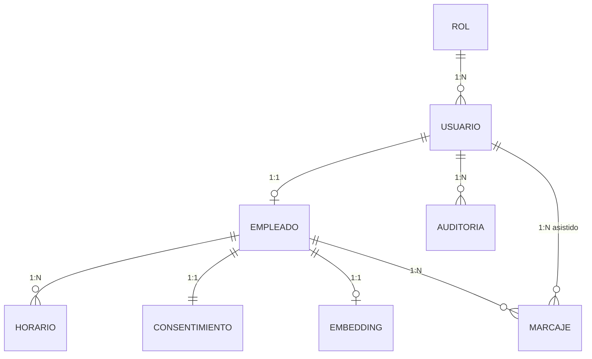
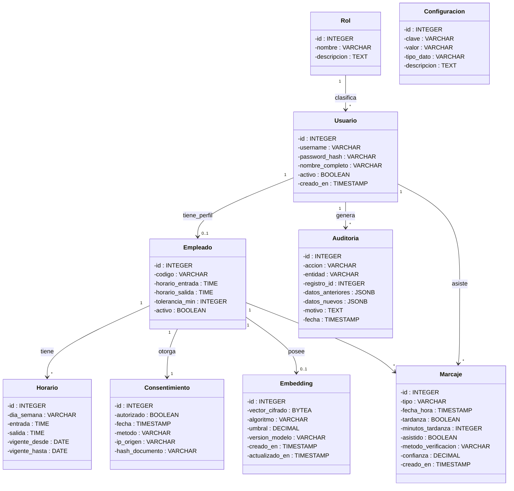

# Modelo Entidad-Relación Extendido (EER+)

## Sistema de Control de Asistencia con Reconocimiento Facial

> [!IMPORTANT]
> **DOCUMENTO DE MODELO LÓGICO DE BASE DE DATOS**
> Especificación independiente de tecnología. Referencia definitiva para implementación.

---

# ÍNDICE

1. [Tipos de Datos](#1-tipos-de-datos)
2. [Diagrama EER+](#2-diagrama-eer)
3. [Especificación de Entidades](#3-especificación-de-entidades)
4. [Modelo Relacional](#4-modelo-relacional)
5. [Diagrama UML de Clases](#5-diagrama-uml-de-clases)
6. [Restricciones de Integridad](#6-restricciones-de-integridad)
7. [Reglas de Negocio](#7-reglas-de-negocio)
8. [Normalización (Metodología Elmasri)](#8-normalización)
9. [Validación de Requisitos](#9-validación-de-requisitos)
10. [Estructura de la Base de Datos](#10-estructura-de-la-base-de-datos)
11. [Flujo de Operación](#11-flujo-de-operación)

---

# 1. TIPOS DE DATOS

## 1.1 Mapeo Lógico a Físico

| Tipo Lógico | Tipo SQL | Descripción | Ejemplo |
|-------------|----------|-------------|---------|
| `ID` | `SERIAL` | Clave primaria autoincremental | 1, 2, 3 |
| `TEXTO_CORTO` | `VARCHAR(50)` | Texto ≤50 caracteres | "admin" |
| `TEXTO_MEDIO` | `VARCHAR(100)` | Texto ≤100 caracteres | "jperez" |
| `TEXTO_LARGO` | `VARCHAR(255)` | Texto ≤255 caracteres | "Juan Pérez" |
| `TEXTO_LIBRE` | `TEXT` | Texto sin límite | Descripciones |
| `ENTERO` | `INTEGER` | Números enteros | 5, 60, 120 |
| `DECIMAL` | `DECIMAL(5,4)` | Números decimales | 0.8500 |
| `BOOLEANO` | `BOOLEAN` | Verdadero/Falso | TRUE, FALSE |
| `FECHA` | `DATE` | Solo fecha | 2026-01-10 |
| `HORA` | `TIME` | Solo hora | 08:00:00 |
| `FECHA_HORA` | `TIMESTAMP` | Fecha y hora | 2026-01-10 08:03:45 |
| `BINARIO` | `BYTEA` | Datos binarios | Vectores cifrados |
| `JSON` | `JSONB` | Estructura JSON | {"clave": "valor"} |
| `ENUM` | `VARCHAR(20)` | Valores fijos | ENTRADA, SALIDA |

## 1.2 Símbolos de Restricción

| Símbolo | Significado |
|---------|-------------|
| **PK** | Primary Key |
| **UK** | Unique Key |
| **FK** | Foreign Key |
| **NN** | Not Null |
| **D** | Default |

---

# 2. DIAGRAMA EER+

## 2.1 Vista General del Sistema

```
┌─────────────────────────────────────────────────────────────────────────────┐
│                         MODELO DE DATOS DEL SISTEMA                         │
├─────────────────────────────────────────────────────────────────────────────┤
│                                                                             │
│   ┌─────────────┐                                                           │
│   │     ROL     │◄─────────────┐                                            │
│   │ ─────────── │              │ clasifica (1:N)                            │
│   │ id (PK)     │              │                                            │
│   │ nombre (UK) │         ┌────┴────────┐                                   │
│   └─────────────┘         │   USUARIO   │◄────────────────┐                 │
│                           │ ─────────── │                  │                │
│                           │ id (PK)     │                  │ genera (1:N)   │
│                           │ username(UK)│                  │                │
│                           │ rol_id (FK) │                  │                │
│                           └──────┬──────┘                  │                │
│                                  │ tiene_perfil (1:1)      │                │
│                                  ▼                         │                │
│                           ┌─────────────┐                  │                │
│                           │  EMPLEADO   │                  │                │
│                           │ ─────────── │                  │                │
│                           │ id (PK)     │                  │                │
│                           │ usuario_id  │                  │                │
│                           │ (FK, UK)    │                  │                │
│                           │ codigo (UK) │                  │                │
│                           └──────┬──────┘                  │                │
│                                  │                         │                │
│           ┌──────────────────────┼──────────────────────┐  │                │
│           │                      │                      │  │                │
│           ▼ tiene (1:N)          ▼ otorga (1:1)         ▼  │ posee (1:1)    │
│   ┌─────────────┐        ┌─────────────────┐   ┌───────────┴───┐            │
│   │   HORARIO   │        │ CONSENTIMIENTO  │   │   EMBEDDING   │            │
│   │ ─────────── │        │ ─────────────── │   │ ───────────── │            │
│   │ id (PK)     │        │ id (PK)         │   │ id (PK)       │            │
│   │ empleado_id │        │ empleado_id     │   │ empleado_id   │            │
│   │ dia_semana  │        │ (FK, UK)        │   │ (FK, UK)      │            │
│   └─────────────┘        └─────────────────┘   └───────────────┘            │
│                                                                             │
│           ┌──────────────────────────────────────────────────────────────┐  │
│           │                                                              │  │
│           ▼ registra (1:N)                                               │  │
│   ┌─────────────────┐                                            ┌───────┴──┐
│   │    MARCAJE      │◄─────────── asiste (1:N) ──────────────────│AUDITORIA │
│   │ ─────────────── │                                            │ ──────── │
│   │ id (PK)         │                                            │ id (PK)  │
│   │ empleado_id(FK) │                                            │usuario_id│
│   │ tipo            │                                            │ accion   │
│   │ creado_por (FK) │                                            └──────────┘
│   └─────────────────┘                                                       │
│                                                                             │
│   ┌─────────────────┐                                                       │
│   │ CONFIGURACION   │  (Entidad independiente)                              │
│   │ ─────────────── │                                                       │
│   │ id (PK)         │                                                       │
│   │ clave (UK)      │                                                       │
│   └─────────────────┘                                                       │
│                                                                             │
└─────────────────────────────────────────────────────────────────────────────┘
```

## 2.2 Diagrama Entidad-Relación

```mermaid
erDiagram
    ROL ||--o{ USUARIO : "clasifica"
    USUARIO ||--o| EMPLEADO : "tiene_perfil"
    EMPLEADO ||--o{ HORARIO : "tiene"
    EMPLEADO ||--|| CONSENTIMIENTO : "otorga"
    EMPLEADO ||--o| EMBEDDING : "posee"
    EMPLEADO ||--o{ MARCAJE : "registra"
    USUARIO ||--o{ MARCAJE : "asiste"
    USUARIO ||--o{ AUDITORIA : "genera"

    ROL {
        SERIAL id PK
        VARCHAR_50 nombre UK
        TEXT descripcion
    }

    USUARIO {
        SERIAL id PK
        VARCHAR_100 username UK
        VARCHAR_255 password_hash NN
        INTEGER rol_id FK
        VARCHAR_255 nombre_completo NN
        BOOLEAN activo NN
        TIMESTAMP creado_en NN
    }

    EMPLEADO {
        SERIAL id PK
        INTEGER usuario_id FK-UK
        VARCHAR_20 codigo UK
        TIME horario_entrada NN
        TIME horario_salida NN
        INTEGER tolerancia_min NN
        BOOLEAN activo NN
    }

    HORARIO {
        SERIAL id PK
        INTEGER empleado_id FK
        VARCHAR_3 dia_semana NN
        TIME entrada NN
        TIME salida NN
        DATE vigente_desde NN
        DATE vigente_hasta
    }

    CONSENTIMIENTO {
        SERIAL id PK
        INTEGER empleado_id FK-UK
        BOOLEAN autorizado NN
        TIMESTAMP fecha NN
        VARCHAR_50 metodo NN
        VARCHAR_45 ip_origen
        VARCHAR_64 hash_documento
    }

    EMBEDDING {
        SERIAL id PK
        INTEGER empleado_id FK-UK
        BYTEA vector_cifrado NN
        VARCHAR_20 algoritmo NN
        DECIMAL umbral NN
        VARCHAR_20 version_modelo NN
        TIMESTAMP creado_en NN
        TIMESTAMP actualizado_en
    }

    MARCAJE {
        SERIAL id PK
        INTEGER empleado_id FK
        VARCHAR_20 tipo NN
        TIMESTAMP fecha_hora NN
        BOOLEAN tardanza NN
        INTEGER minutos_tardanza
        INTEGER creado_por FK
        BOOLEAN asistido NN
        VARCHAR_20 metodo_verificacion NN
        DECIMAL confianza
        TIMESTAMP creado_en NN
    }

    AUDITORIA {
        SERIAL id PK
        INTEGER usuario_id FK
        VARCHAR_50 accion NN
        VARCHAR_100 entidad NN
        INTEGER registro_id NN
        JSONB datos_anteriores
        JSONB datos_nuevos
        TEXT motivo
        TIMESTAMP fecha NN
    }

    CONFIGURACION {
        SERIAL id PK
        VARCHAR_100 clave UK
        VARCHAR_500 valor NN
        VARCHAR_20 tipo_dato NN
        TEXT descripcion
    }
```

## 2.3 Especialización/Generalización (Metodología Elmasri)

```
                         ┌─────────────────┐
                         │     USUARIO     │  ◄── Superclase
                         │ ═══════════════ │
                         │ • username      │
                         │ • password_hash │
                         │ • activo        │
                         └────────┬────────┘
                                  │
                                  │ d = {overlapping, partial}
                                  │
                    ┌─────────────┴─────────────┐
                    │                           │
             ┌──────┴──────┐             ┌──────┴──────┐
             │    ADMIN    │             │  EMPLEADO   │  ◄── Subclases
             │ ═══════════ │             │ ═══════════ │
             │ (por rol)   │             │ • codigo    │
             └─────────────┘             │ • horarios  │
                                         └─────────────┘
```

| Restricción | Valor | Significado |
|-------------|-------|-------------|
| **Disjunción** | Overlapping | Usuario puede ser ADMIN y EMPLEADO simultáneamente |
| **Completitud** | Partial | Usuario puede no pertenecer a ninguna subclase |

## 2.4 Entidad Débil: EMBEDDING

> 💡 **EMBEDDING depende existencialmente de EMPLEADO.** Si se elimina el empleado, el embedding se elimina en cascada (requisito de privacidad).

```
    ┌─────────────┐                     ┌─────────────────┐
    │  EMPLEADO   │═════════════════════│    EMBEDDING    │
    │  (Fuerte)   │       posee         │    (Débil)      │
    │     PK      │        1:1          │   Clave Parcial │
    └─────────────┘                     └─────────────────┘
```

## 2.5 Atributo Multivaluado → Entidad

```
ANTES:                              DESPUÉS:
┌─────────────────┐                 ┌─────────────┐         ┌─────────────┐
│    EMPLEADO     │                 │  EMPLEADO   │────────<│   HORARIO   │
│ {horarios}      │        →        │             │   1:N   │             │
└─────────────────┘                 └─────────────┘         └─────────────┘
```

---

# 3. ESPECIFICACIÓN DE ENTIDADES

## 3.1 Entidad: ROL

**Clasificación:** Entidad Fuerte

| Columna | Tipo SQL | Restricciones | Descripción |
|---------|----------|---------------|-------------|
| `id` | `SERIAL` | PK, NN | Identificador único |
| `nombre` | `VARCHAR(50)` | UK, NN | Nombre del rol |
| `descripcion` | `TEXT` | — | Descripción funcional |

**Valores Predefinidos:**

| id | nombre | descripcion |
|:--:|--------|-------------|
| 1 | ADMINISTRADOR | Acceso completo |
| 2 | EMPLEADO | Acceso limitado |

---

## 3.2 Entidad: USUARIO

**Clasificación:** Entidad Fuerte (Superclase)

| Columna | Tipo SQL | Restricciones | Descripción |
|---------|----------|---------------|-------------|
| `id` | `SERIAL` | PK, NN | Identificador único |
| `username` | `VARCHAR(100)` | UK, NN | Nombre de usuario |
| `password_hash` | `VARCHAR(255)` | NN | Hash bcrypt/argon2 |
| `rol_id` | `INTEGER` | FK→ROL, NN | Rol asignado |
| `nombre_completo` | `VARCHAR(255)` | NN | Nombre de la persona |
| `activo` | `BOOLEAN` | NN, D=TRUE | Estado de la cuenta |
| `creado_en` | `TIMESTAMP` | NN, D=NOW() | Fecha de creación |

---

## 3.3 Entidad: EMPLEADO

**Clasificación:** Entidad Fuerte (Subclase)

| Columna | Tipo SQL | Restricciones | Descripción |
|---------|----------|---------------|-------------|
| `id` | `SERIAL` | PK, NN | Identificador único |
| `usuario_id` | `INTEGER` | FK→USUARIO, UK, NN | Relación 1:1 |
| `codigo` | `VARCHAR(20)` | UK, NN | Código de empleado |
| `horario_entrada` | `TIME` | NN | Hora entrada por defecto |
| `horario_salida` | `TIME` | NN | Hora salida por defecto |
| `tolerancia_min` | `INTEGER` | NN, D=5 | Tolerancia en minutos |
| `activo` | `BOOLEAN` | NN, D=TRUE | Estado laboral |

**Restricciones de Dominio:**

| Nombre | Expresión |
|--------|-----------|
| CHK_tolerancia | `0 ≤ tolerancia_min ≤ 120` |
| CHK_horario | `horario_entrada < horario_salida` |

---

## 3.4 Entidad: HORARIO

**Clasificación:** Entidad Fuerte (derivada de atributo multivaluado)

| Columna | Tipo SQL | Restricciones | Descripción |
|---------|----------|---------------|-------------|
| `id` | `SERIAL` | PK, NN | Identificador único |
| `empleado_id` | `INTEGER` | FK→EMPLEADO, NN | Empleado propietario |
| `dia_semana` | `VARCHAR(3)` | NN | LUN, MAR, MIE, JUE, VIE, SAB, DOM |
| `entrada` | `TIME` | NN | Hora de entrada |
| `salida` | `TIME` | NN | Hora de salida |
| `vigente_desde` | `DATE` | NN | Inicio de vigencia |
| `vigente_hasta` | `DATE` | — | Fin de vigencia (NULL=indefinido) |

**UK Compuesta:** (`empleado_id`, `dia_semana`, `vigente_desde`)

---

## 3.5 Entidad: CONSENTIMIENTO

**Clasificación:** Entidad Fuerte

> 💡 **Cumplimiento normativo:** Registro obligatorio antes de almacenar datos biométricos.

| Columna | Tipo SQL | Restricciones | Descripción |
|---------|----------|---------------|-------------|
| `id` | `SERIAL` | PK, NN | Identificador único |
| `empleado_id` | `INTEGER` | FK→EMPLEADO, UK, NN | Relación 1:1 |
| `autorizado` | `BOOLEAN` | NN | Estado de autorización |
| `fecha` | `TIMESTAMP` | NN | Momento de autorización |
| `metodo` | `VARCHAR(50)` | NN | FIRMA_DIGITAL, ACEPTACION_APP, DOCUMENTO_FISICO |
| `ip_origen` | `VARCHAR(45)` | — | Dirección IP origen |
| `hash_documento` | `VARCHAR(64)` | — | SHA-256 del documento |

---

## 3.6 Entidad: EMBEDDING (Entidad Débil)

**Clasificación:** Entidad Débil

> 💡 **Seguridad:** Vector cifrado con AES-256-GCM. No almacena imágenes, solo representación matemática.

| Columna | Tipo SQL | Restricciones | Descripción |
|---------|----------|---------------|-------------|
| `id` | `SERIAL` | PK, NN | Identificador único |
| `empleado_id` | `INTEGER` | FK→EMPLEADO, UK, NN | Propietario (1:1) |
| `vector_cifrado` | `BYTEA` | NN | Vector facial cifrado |
| `algoritmo` | `VARCHAR(20)` | NN, D='AES-256-GCM' | Algoritmo de cifrado |
| `umbral` | `DECIMAL(3,2)` | NN, D=0.60 | Umbral de confianza |
| `version_modelo` | `VARCHAR(20)` | NN | Versión del modelo facial |
| `creado_en` | `TIMESTAMP` | NN, D=NOW() | Fecha de creación |
| `actualizado_en` | `TIMESTAMP` | — | Última actualización |

**Restricción de Dominio:** `0.10 ≤ umbral ≤ 0.99`

---

## 3.7 Entidad: MARCAJE

**Clasificación:** Entidad Fuerte

| Columna | Tipo SQL | Restricciones | Descripción |
|---------|----------|---------------|-------------|
| `id` | `SERIAL` | PK, NN | Identificador único |
| `empleado_id` | `INTEGER` | FK→EMPLEADO, NN | Empleado que marca |
| `tipo` | `VARCHAR(20)` | NN | ENTRADA, SALIDA, BREAK_INICIO, BREAK_FIN |
| `fecha_hora` | `TIMESTAMP` | NN | Momento del marcaje |
| `tardanza` | `BOOLEAN` | NN, D=FALSE | Indicador de tardanza |
| `minutos_tardanza` | `INTEGER` | — | Minutos de retraso |
| `creado_por` | `INTEGER` | FK→USUARIO | Admin que asistió |
| `asistido` | `BOOLEAN` | NN, D=FALSE | Marcaje asistido |
| `metodo_verificacion` | `VARCHAR(20)` | NN, D='FACIAL' | FACIAL, MANUAL, ASISTIDO |
| `confianza` | `DECIMAL(5,4)` | — | Nivel de confianza (0-1) |
| `creado_en` | `TIMESTAMP` | NN, D=NOW() | Fecha de registro |

### Restricciones de Consistencia

| ID | Condición |
|----|-----------|
| RC01 | `tardanza = TRUE → minutos_tardanza > 0` |
| RC02 | `tardanza = FALSE → minutos_tardanza IS NULL` |
| RC03 | `asistido = TRUE → creado_por IS NOT NULL` |
| RC04 | `asistido = FALSE → creado_por IS NULL` |

---

## 3.8 Entidad: AUDITORIA

**Clasificación:** Entidad Fuerte

> 💡 **Inmutabilidad:** Esta tabla no permite UPDATE ni DELETE. Registro permanente para auditorías.

| Columna | Tipo SQL | Restricciones | Descripción |
|---------|----------|---------------|-------------|
| `id` | `SERIAL` | PK, NN | Identificador único |
| `usuario_id` | `INTEGER` | FK→USUARIO, NN | Usuario que realizó acción |
| `accion` | `VARCHAR(50)` | NN | CREAR, MODIFICAR, ELIMINAR, LOGIN, LOGOUT, MARCAJE_ASISTIDO |
| `entidad` | `VARCHAR(100)` | NN | Entidad afectada |
| `registro_id` | `INTEGER` | NN | ID del registro afectado |
| `datos_anteriores` | `JSONB` | — | Estado anterior |
| `datos_nuevos` | `JSONB` | — | Estado nuevo |
| `motivo` | `TEXT` | — | Justificación |
| `fecha` | `TIMESTAMP` | NN, D=NOW() | Fecha de la acción |

---

## 3.9 Entidad: CONFIGURACION

**Clasificación:** Entidad Fuerte (Independiente)

| Columna | Tipo SQL | Restricciones | Descripción |
|---------|----------|---------------|-------------|
| `id` | `SERIAL` | PK, NN | Identificador único |
| `clave` | `VARCHAR(100)` | UK, NN | Nombre del parámetro |
| `valor` | `VARCHAR(500)` | NN | Valor del parámetro |
| `tipo_dato` | `VARCHAR(20)` | NN, D='STRING' | STRING, INTEGER, DECIMAL, BOOLEAN |
| `descripcion` | `TEXT` | — | Descripción |

**Parámetros Iniciales:**

| clave | valor | tipo_dato |
|-------|-------|-----------|
| tolerancia_global | 5 | INTEGER |
| umbral_facial | 0.60 | DECIMAL |
| intentos_max | 3 | INTEGER |
| tiempo_max_marcaje | 30 | INTEGER |

---

# 4. MODELO RELACIONAL

## 4.1 Esquema Relacional

```
ROL (id, nombre, descripcion)
    PK: {id}  UK: {nombre}

USUARIO (id, username, password_hash, rol_id, nombre_completo, activo, creado_en)
    PK: {id}  UK: {username}  FK: {rol_id} → ROL(id)

EMPLEADO (id, usuario_id, codigo, horario_entrada, horario_salida, tolerancia_min, activo)
    PK: {id}  UK: {usuario_id}, {codigo}  FK: {usuario_id} → USUARIO(id)

HORARIO (id, empleado_id, dia_semana, entrada, salida, vigente_desde, vigente_hasta)
    PK: {id}  UK: {empleado_id, dia_semana, vigente_desde}  FK: {empleado_id} → EMPLEADO(id)

CONSENTIMIENTO (id, empleado_id, autorizado, fecha, metodo, ip_origen, hash_documento)
    PK: {id}  UK: {empleado_id}  FK: {empleado_id} → EMPLEADO(id)

EMBEDDING (id, empleado_id, vector_cifrado, algoritmo, umbral, version_modelo, creado_en, actualizado_en)
    PK: {id}  UK: {empleado_id}  FK: {empleado_id} → EMPLEADO(id)

MARCAJE (id, empleado_id, tipo, fecha_hora, tardanza, minutos_tardanza, creado_por, asistido, 
         metodo_verificacion, confianza, creado_en)
    PK: {id}  FK: {empleado_id} → EMPLEADO(id), {creado_por} → USUARIO(id)

AUDITORIA (id, usuario_id, accion, entidad, registro_id, datos_anteriores, datos_nuevos, motivo, fecha)
    PK: {id}  FK: {usuario_id} → USUARIO(id)

CONFIGURACION (id, clave, valor, tipo_dato, descripcion)
    PK: {id}  UK: {clave}
```

## 4.2 Diagrama Relacional



---

# 5. DIAGRAMA UML DE CLASES



---

# 6. RESTRICCIONES DE INTEGRIDAD

## 6.1 Claves Primarias

| Entidad | PK | Tipo |
|---------|-----|------|
| ROL | `id` | `SERIAL` |
| USUARIO | `id` | `SERIAL` |
| EMPLEADO | `id` | `SERIAL` |
| HORARIO | `id` | `SERIAL` |
| CONSENTIMIENTO | `id` | `SERIAL` |
| EMBEDDING | `id` | `SERIAL` |
| MARCAJE | `id` | `SERIAL` |
| AUDITORIA | `id` | `SERIAL` |
| CONFIGURACION | `id` | `SERIAL` |

## 6.2 Claves Foráneas

| Origen | FK | Destino | ON DELETE | ON UPDATE |
|--------|-----|---------|-----------|-----------|
| USUARIO | rol_id | ROL.id | RESTRICT | CASCADE |
| EMPLEADO | usuario_id | USUARIO.id | CASCADE | CASCADE |
| HORARIO | empleado_id | EMPLEADO.id | CASCADE | CASCADE |
| CONSENTIMIENTO | empleado_id | EMPLEADO.id | CASCADE | CASCADE |
| EMBEDDING | empleado_id | EMPLEADO.id | CASCADE | CASCADE |
| MARCAJE | empleado_id | EMPLEADO.id | RESTRICT | CASCADE |
| MARCAJE | creado_por | USUARIO.id | SET NULL | CASCADE |
| AUDITORIA | usuario_id | USUARIO.id | RESTRICT | CASCADE |

## 6.3 Claves Únicas

| Entidad | Columna(s) |
|---------|------------|
| ROL | nombre |
| USUARIO | username |
| EMPLEADO | usuario_id, codigo |
| CONSENTIMIENTO | empleado_id |
| EMBEDDING | empleado_id |
| HORARIO | (empleado_id, dia_semana, vigente_desde) |
| CONFIGURACION | clave |

## 6.4 Restricciones CHECK

| Entidad | Nombre | Expresión |
|---------|--------|-----------|
| EMPLEADO | CHK_tolerancia | `tolerancia_min BETWEEN 0 AND 120` |
| EMPLEADO | CHK_horario | `horario_entrada < horario_salida` |
| HORARIO | CHK_tiempo | `entrada < salida` |
| HORARIO | CHK_vigencia | `vigente_hasta IS NULL OR vigente_hasta > vigente_desde` |
| EMBEDDING | CHK_umbral | `umbral BETWEEN 0.10 AND 0.99` |
| MARCAJE | CHK_minutos | `minutos_tardanza IS NULL OR minutos_tardanza >= 0` |
| MARCAJE | CHK_confianza | `confianza IS NULL OR confianza BETWEEN 0 AND 1` |

---

# 7. REGLAS DE NEGOCIO

## 7.1 Reglas de Validación

| ID | Regla | Descripción |
|----|-------|-------------|
| RN01 | Entrada única por día | Solo UN marcaje ENTRADA por empleado por día calendario |
| RN02 | Consentimiento previo | EMBEDDING requiere CONSENTIMIENTO con autorizado=TRUE |
| RN03 | Usuario único por empleado | Relación 1:1 estricta |
| RN04 | Horario coherente | entrada < salida |

## 7.2 Reglas de Cálculo

| ID | Fórmula |
|----|---------|
| RC01 | `tardanza = fecha_hora > (horario_entrada + tolerancia_min)` |
| RC02 | `minutos_tardanza = fecha_hora - horario_entrada` |

## 7.3 Reglas de Auditoría

| ID | Regla |
|----|-------|
| RA01 | Toda modificación de MARCAJE genera AUDITORIA |
| RA02 | Marcaje asistido genera AUDITORIA con accion='MARCAJE_ASISTIDO' |
| RA03 | AUDITORIA es inmutable (no UPDATE, no DELETE) |

## 7.4 Reglas de Seguridad

| ID | Regla |
|----|-------|
| RS01 | vector_cifrado usa AES-256-GCM |
| RS02 | password_hash usa bcrypt/argon2 |
| RS03 | Solo rol ADMINISTRADOR puede crear marcajes asistidos |

---

# 8. NORMALIZACIÓN

## 8.1 Verificación (Metodología Elmasri)

| Forma Normal | Criterio | Estado |
|--------------|----------|:------:|
| **1NF** | Valores atómicos, no grupos repetitivos, PK definida | ✓ |
| **2NF** | 1NF + sin dependencias parciales | ✓ |
| **3NF** | 2NF + sin dependencias transitivas | ✓ |
| **BCNF** | 3NF + todo determinante es clave candidata | ✓ |

## 8.2 Dependencias Funcionales

```
ROL:          id → nombre, descripcion
USUARIO:      id → username, password_hash, rol_id, nombre_completo, activo, creado_en
EMPLEADO:     id → usuario_id, codigo, horario_entrada, horario_salida, tolerancia_min, activo
HORARIO:      id → empleado_id, dia_semana, entrada, salida, vigente_desde, vigente_hasta
CONSENTIMIENTO: id → empleado_id, autorizado, fecha, metodo, ip_origen, hash_documento
EMBEDDING:    id → empleado_id, vector_cifrado, algoritmo, umbral, version_modelo, creado_en, actualizado_en
MARCAJE:      id → empleado_id, tipo, fecha_hora, tardanza, minutos_tardanza, creado_por, asistido, 
                   metodo_verificacion, confianza, creado_en
AUDITORIA:    id → usuario_id, accion, entidad, registro_id, datos_anteriores, datos_nuevos, motivo, fecha
CONFIGURACION: id → clave, valor, tipo_dato, descripcion
```

## 8.3 Análisis de Anomalías

| Anomalía | ¿Presente? |
|----------|:----------:|
| Inserción | ✗ |
| Actualización | ✗ |
| Eliminación | ✗ |

---

# 9. VALIDACIÓN DE REQUISITOS

## 9.1 Cobertura

```
┌─────────────────────────────────────────────────────────────┐
│                  COBERTURA DE REQUISITOS                    │
├─────────────────────────────────────────────────────────────┤
│   Must (Obligatorios):    28/28  ████████████████████ 100%  │
│   Should (Deseables):      6/6   ████████████████████ 100%  │
│   Could (Opcionales):      1/1   ████████████████████ 100%  │
│                                                             │
│   TOTAL:                  35/35  ████████████████████ 100%  │
│                                                             │
│   Estado: ✓ MODELO VALIDADO                                 │
└─────────────────────────────────────────────────────────────┘
```

---

# 10. ESTRUCTURA DE LA BASE DE DATOS

## 10.1 Organización de Archivos

```
data_base/
├── database_model.md           ◄── Este documento
├── migrations/                  ◄── Scripts DDL
│   ├── V001__create_roles.sql
│   ├── V002__create_users.sql
│   ├── V003__create_employees.sql
│   ├── V004__create_schedules.sql
│   ├── V005__create_consents.sql
│   ├── V006__create_embeddings.sql
│   ├── V007__create_attendances.sql
│   ├── V008__create_audit_logs.sql
│   └── V009__create_configs.sql
├── seeds/                       ◄── Datos iniciales
│   ├── seed_roles.sql
│   └── seed_configs.sql
├── triggers/                    ◄── Lógica de negocio
│   ├── trg_attendance_audit.sql
│   └── trg_consent_validation.sql
└── indexes/                     ◄── Índices de rendimiento
    └── create_indexes.sql
```

## 10.2 Resumen de Entidades

| # | Entidad | Cols | PK | FK | UK | Propósito |
|:-:|---------|:----:|:--:|:--:|:--:|-----------|
| 1 | ROL | 3 | 1 | 0 | 1 | Tipos de usuario |
| 2 | USUARIO | 7 | 1 | 1 | 1 | Cuentas de acceso |
| 3 | EMPLEADO | 7 | 1 | 1 | 2 | Perfiles laborales |
| 4 | HORARIO | 7 | 1 | 1 | 1* | Horarios por día |
| 5 | CONSENTIMIENTO | 7 | 1 | 1 | 1 | Autorizaciones |
| 6 | EMBEDDING | 8 | 1 | 1 | 1 | Vectores faciales |
| 7 | MARCAJE | 11 | 1 | 2 | 0 | Registros asistencia |
| 8 | AUDITORIA | 9 | 1 | 1 | 0 | Historial cambios |
| 9 | CONFIGURACION | 5 | 1 | 0 | 1 | Parámetros |

**Totales:** 9 entidades, 64 columnas, 8 relaciones

---

# 11. FLUJO DE OPERACIÓN

## 11.1 Flujo de Marcaje de Asistencia

```
                                    FLUJO DE MARCAJE
┌─────────────────────────────────────────────────────────────────────────────┐
│                                                                             │
│     ┌───────┐                                                               │
│     │   1   │  Empleado mira cámara                                         │
│     └───┬───┘                                                               │
│         │                                                                   │
│         ▼                                                                   │
│     ┌───────┐      ┌─────────────┐                                          │
│     │   2   │─────►│  EMBEDDING  │  Sistema busca vector facial             │
│     └───┬───┘      └─────────────┘  → Match encontrado (98% confianza)      │
│         │                                                                   │
│         ▼                                                                   │
│     ┌───────┐      ┌─────────────┐                                          │
│     │   3   │─────►│  EMPLEADO   │  Consulta horario y tolerancia           │
│     └───┬───┘      │  HORARIO    │  → Entrada: 08:00, Tolerancia: 5min      │
│         │          └─────────────┘                                          │
│         ▼                                                                   │
│     ┌───────┐      ┌──────────────────┐                                     │
│     │   4   │─────►│  CONSENTIMIENTO  │  Verifica autorización              │
│     └───┬───┘      └──────────────────┘  → Autorizado: TRUE ✓               │
│         │                                                                   │
│         ▼                                                                   │
│     ┌───────┐                                                               │
│     │   5   │  Calcula tardanza                                             │
│     └───┬───┘  → Hora actual: 08:03                                         │
│         │      → 08:03 - 08:00 = 3 min                                      │
│         │      → 3 min ≤ 5 min tolerancia                                   │
│         │      → NO ES TARDANZA ✓                                           │
│         ▼                                                                   │
│     ┌───────┐      ┌─────────────┐                                          │
│     │   6   │─────►│  MARCAJE    │  Crea registro                           │
│     └───┬───┘      └─────────────┘  ┌────────────────────────────────┐      │
│         │                           │ tipo: ENTRADA                  │      │
│         │                           │ fecha_hora: 2026-01-10 08:03:00│      │
│         │                           │ tardanza: FALSE                │      │
│         │                           │ confianza: 0.98                │      │
│         ▼                           └────────────────────────────────┘      │
│     ┌───────┐                                                               │
│     │   7   │  Muestra mensaje de éxito                                     │
│     └───────┘  → "Marcaje exitoso"                                          │
│                                                                             │
└─────────────────────────────────────────────────────────────────────────────┘
```

## 11.2 Descripción del Flujo

| Paso | Acción | Entidad | Resultado |
|:----:|--------|---------|-----------|
| 1 | Empleado mira cámara | — | Captura imagen |
| 2 | Sistema busca embedding | EMBEDDING | Match con % confianza |
| 3 | Consulta horario | EMPLEADO, HORARIO | Hora entrada + tolerancia |
| 4 | Verifica consentimiento | CONSENTIMIENTO | Autorizado = TRUE |
| 5 | Calcula tardanza | — | Compara hora actual vs horario |
| 6 | Crea registro | MARCAJE | Nuevo registro de entrada |
| 7 | Muestra resultado | — | Mensaje de éxito/error |

---

> [!TIP]
> **Referencia definitiva** para implementación en cualquier motor SQL.
