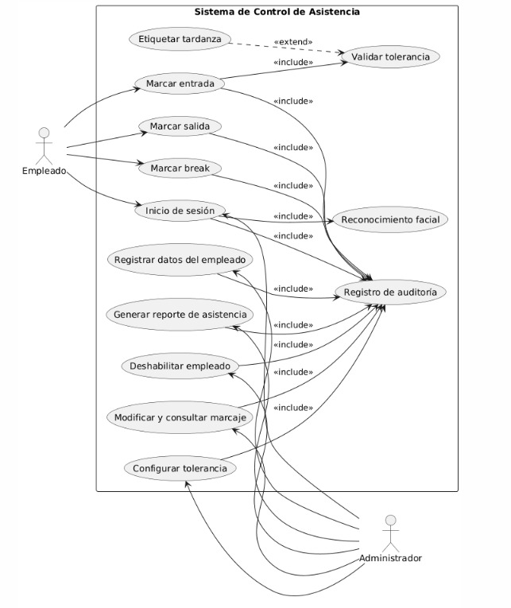

# 📚 Planeamiento, Casos de Uso y Arquitectura (Projects)

Bienvenido al espacio de **Investigación y Diseño** de RAMar Software Studio. 
Aquí guardamos los planos estructurales, diagramas y reglas del negocio que sostienen nuestros sistemas antes de empezar a programarlos. Presentamos a continuación toda la ingeniería detrás del Sistema de Control de Asistencia Biométrico.

---

## ⚙️ Nuestra Metodología (¿Cómo diseñamos?)

Aplicamos un flujo de trabajo ágil y estricto para asegurar un desarrollo perfecto:
1. **Casos de Uso:** Traducimos las necesidades de la empresa en historias exactas y medibles.
2. **Filtro MoSCoW:** Definimos qué funciones son *Obligatorias (Must)* y cuáles descartamos *(Won't)* para evitar que el cliente pierda tiempo en extras innecesarios.
3. **Decisiones de Arquitectura:** Justificamos formalmente qué tecnología es la más rápida para el negocio.

---

## 📸 Caso de Estudio: Control de Asistencia Biométrico

**El Reto:** Crear un sistema de marcaje de personal con reconocimiento facial súper rápido y 100% sin internet para corporativos. Frenar las suplantaciones de identidad protegiendo legalmente la privacidad (sin robar fotos) y consumiendo muy pocos recursos informáticos.

A continuación, desplegamos los documentos robústos clave de este proyecto:

### 📄 A. Definición de la Aquitectura (Por qué lo hicimos así)
En lugar de depender de una conexión HTTP inestable, decidimos migrar a C# Nativo para ganar acceso puro al hardware.

> **Respuesta Técnica Oficial:**
> Este proyecto presenta una arquitectura del Sistema de Control de Asistencia con reconocimiento facial diseñado para operar exclusivamente en una **red local**, con una **base de datos centralizada (PostgreSQL)** y procesamiento biométrico distribuido mediante un **Microservicio en Python**, orquestado nativamente a través de una **Aplicación de Escritorio WPF (.NET 8)**.
> 
> Durante el análisis **se determinó abandonar la arquitectura web en red local (intranet)** a favor de una arquitectura de aplicación local nativa. Este pivote técnico garantiza control absoluto sobre el hardware (cámaras DShow con OpenCV), suprime la latencia generada por el protocolo HTTP en transmisiones de video en vivo, alivia la presión del navegador web localizando el consumo de RAM/CPU predecible y optimiza radicalmente la persistencia de datos mediante Entity Framework Core Code-First.

---

### 🖼️ B. Diagrama Visual de Casos de Uso (UML)
Antes de tocar el código, mapeamos cómo los actores humanos de la empresa iban a interactuar con el kiosko y los límites administrativos.

---

### 📋 C. Ingeniería de Requisitos (Filtro MoSCoW)
Este es el "Contrato Funcional". Define qué obligaciones cumple el código al 100% (Must) limitando el alcance hacia un MVP corporativo sumamente enfocado y eficiente.

| ID  | Requisito | Descripción clara | MoSCoW |
| --- | --------- | ----------------- | :----: |
| RF01 | Marcado de entrada | Registrar el ingreso del empleado al inicio de su jornada laboral | Must |
| RF02 | Marcado de salida | Registrar la salida del empleado al finalizar su jornada | Must |
| RF03 | Marcado de breaks | Registrar inicio y fin de pausas durante la jornada | Must |
| RF04 | Múltiples marcajes | Permitir registrar varios eventos de asistencia por día | Must |
| RF05 | Límite de marcaje | Restringir a un único marcaje principal de entrada diario | Must |
| RF06 | Registro fuera de horario | Permitir marcajes fuera del horario asignado | Must |
| RF07 | Etiqueta tardanza | Identificar automáticamente marcajes tardíos | Must |
| RF08 | Tolerancia configurable | Configurar minutos de tolerancia según políticas empresariales | Must |
| RF09 | Sistema local | Operar únicamente dentro de la red local corporativa | Must |
| RF10 | Sincronización inmediata | Guardar marcajes de forma inmediata en el servidor local | Must |
| RF11 | Persistencia local | Almacenar marcajes temporalmente ante fallos del servidor | Must |
| RF12 | Reconocimiento facial | Validar identidad mediante cámara web local | Must |
| RF13 | No hardware externo | Excluir el uso de lectores biométricos dedicados | Must |
| RF14 | App de Escritorio | Permitir uso mediante un ejecutable nativo WPF con UI moderno | Must |
| RF15 | Tiempo de marcado | Completar el marcaje en menos de 30 segundos | Must |
| RF18 | Almacenamiento biométrico | Guardar datos biométricos en infraestructura local | Must |
| RF19 | Cifrado de datos | Proteger datos biométricos en tránsito y reposo (AES) | Must |
| RF21 | Cumplimiento normativo | Cumplir regulaciones de protección de datos personales | Must |
| RF22 | Rol empleado | Restringir al empleado a funciones de marcaje | Must |
| RF23 | Rol administrador | Permitir al administrador gestionar usuarios y marcajes | Must |
| RF36 | No trabajo remoto | Bloquear marcajes fuera del entorno local | Must |
| RF37 | Geolocalización | Implementar validación por ubicación | Won’t |
| RF38 | Roles intermedios | Incorporar roles adicionales o sub-managers | Won’t |
| RF39 | Gestión de pagos | Calcular pagos o planillas financieras | Won’t |

**Restricciones Clave Acatadas en el Desarrollo:**
- Sistema confinado estrictamente a la red corporativa de la MYPE.
- **No** recabar fotos. Tratar variables geométricas exclusivamente.
- Respuestas biométricas en menos de 1 segundo de latencia.
