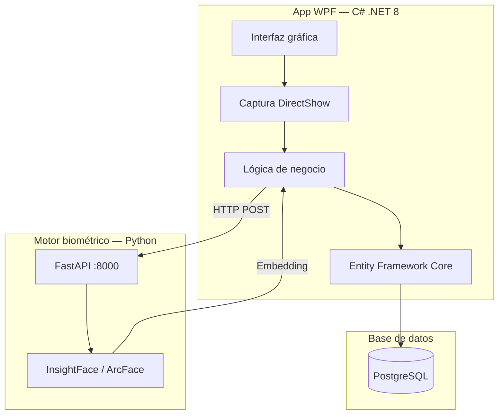

# Arquitectura técnica

El sistema usa una **arquitectura híbrida de dos procesos** que separa la interfaz gráfica de la inteligencia biométrica.

---

## Capas de la aplicación WPF

| Proyecto | Responsabilidad |
|---|---|
| `AttendanceSystem.App` | Interfaz gráfica, vistas XAML |
| `AttendanceSystem.Core` | DTOs, interfaces, enums |
| `AttendanceSystem.Services` | Lógica de negocio |
| `AttendanceSystem.Infrastructure` | Acceso a datos, EF Core |
| `AttendanceSystem.Security` | Autenticación, cifrado AES, sesiones |

## Motor biométrico (Python)

| Módulo | Responsabilidad |
|---|---|
| `api/` | Endpoints REST (FastAPI) |
| `core/` | Interfaces abstractas |
| `adapters/` | Implementación InsightFace |
| `services/` | Pipeline biométrico |

---

## Principios de diseño

- **Abstracción** — Interfaces intercambiables para detector y reconocedor
- **Eficiencia** — Motor IA bajo demanda, se detiene por inactividad
- **Seguridad** — Embeddings cifrados AES-256, solo localhost
- **Separación** — Cada capa tiene una única responsabilidad
