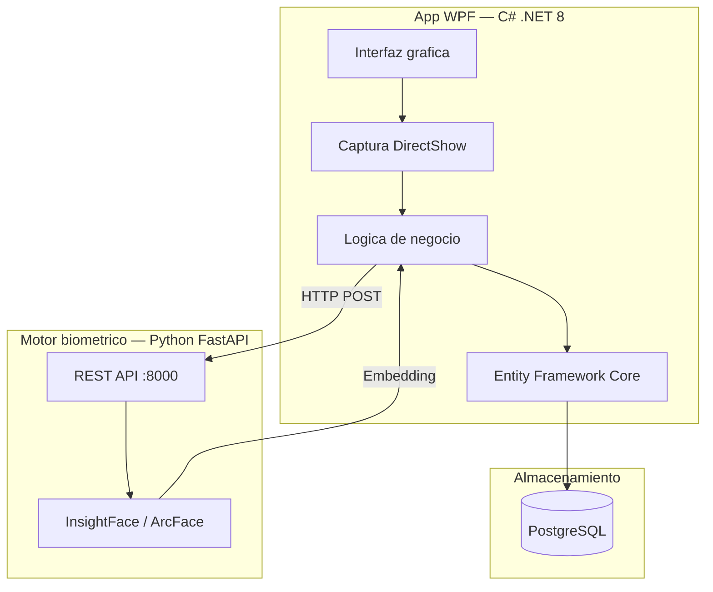

# Arquitectura tecnica

Vista general

El sistema sigue una **arquitectura hibrida de dos procesos** que separa la capa visual de la inteligencia biometrica, comunicandose via HTTP en localhost.

---

Capas del sistema

## Aplicacion WPF (C#)

| Proyecto | Responsabilidad |
|---|---|
| `AttendanceSystem.App` | Interfaz grafica, vistas XAML, code-behind |
| `AttendanceSystem.Core` | DTOs, interfaces, enums — capa sin dependencias |
| `AttendanceSystem.Services` | Logica de negocio, reglas de marcaje |
| `AttendanceSystem.Infrastructure` | Acceso a datos, repositorios, EF Core |
| `AttendanceSystem.Security` | Autenticacion, cifrado AES, sesiones |

## Motor biometrico (Python)

| Modulo | Responsabilidad |
|---|---|
| `api/` | Endpoints REST con FastAPI |
| `core/` | Interfaces abstractas de deteccion y reconocimiento |
| `adapters/` | Implementaciones concretas (InsightFace) |
| `services/` | Orquestacion del pipeline biometrico |

---

Decisiones

## Documentos de arquitectura

-   :material-scale-balance:{ .lg .middle } **ADR: WPF vs Web**

    ---

    Por que se descarto React a favor de una app nativa de escritorio.

    [:octicons-arrow-right-24: Leer decision](adr-wpf.md)

-   :material-face-recognition:{ .lg .middle } **Motor biometrico**

    ---

    InsightFace, ArcFace, cifrado y gestion de recursos del servicio Python.

    [:octicons-arrow-right-24: Ver detalles](motor-biometrico.md)

---

Principios

## Principios de diseno

- **Abstraccion** — Interfaces para detector y reconocedor facial (intercambiables)
- **Eficiencia** — Motor IA bajo demanda, se detiene por inactividad
- **Seguridad** — Embeddings cifrados AES-256, comunicacion solo localhost
- **Separacion** — Cada capa tiene una unica responsabilidad
- **Flexibilidad** — Cambiar de modelo solo requiere un nuevo adapter
