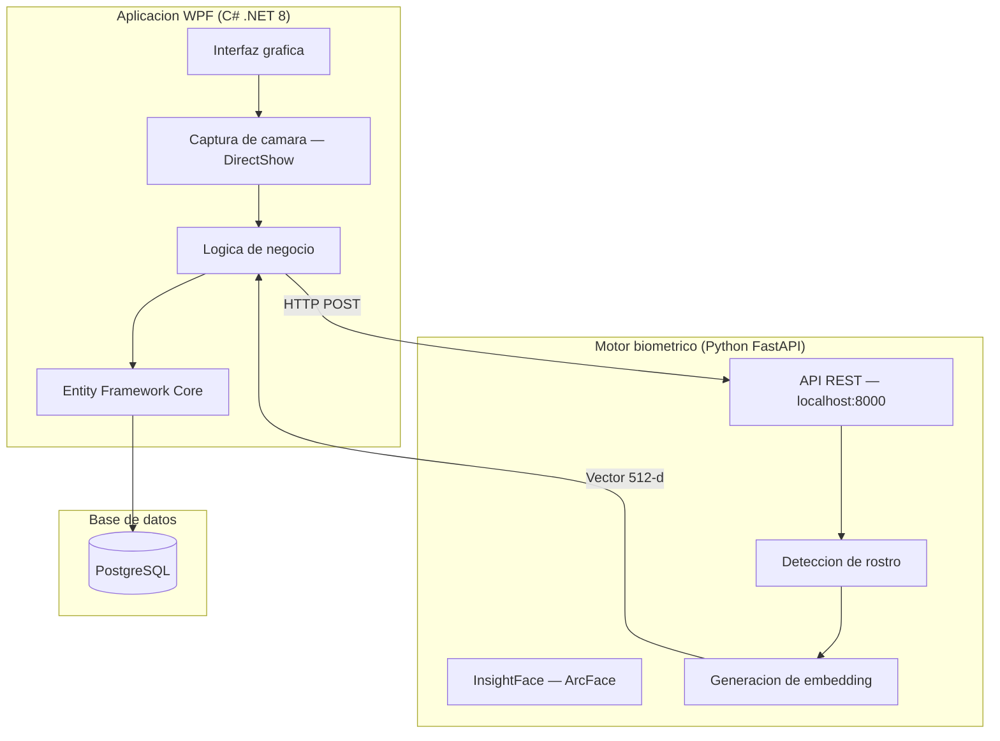

# Arquitectura tecnica

El sistema sigue una **arquitectura hibrida de dos procesos** que separa la capa visual de la inteligencia biometrica, comunicandose mediante HTTP local.

---

## Diagrama general

---

## Componentes

### App WPF (C# .NET 8)

| Capa | Responsabilidad |
|---|---|
| `AttendanceSystem.App` | Interfaz grafica, vistas, code-behind |
| `AttendanceSystem.Core` | DTOs, interfaces, enums |
| `AttendanceSystem.Services` | Logica de negocio |
| `AttendanceSystem.Infrastructure` | Acceso a datos, Entity Framework |
| `AttendanceSystem.Security` | Autenticacion, cifrado, sesiones |

### Motor biometrico (Python)

| Modulo | Responsabilidad |
|---|---|
| `api/` | Endpoints REST (FastAPI) |
| `core/` | Interfaces abstractas de deteccion y reconocimiento |
| `adapters/` | Implementacion concreta con InsightFace |
| `services/` | Logica de negocio biometrica |

### Base de datos (PostgreSQL)

Tablas principales: empleados, marcajes, horarios, embeddings faciales (cifrados), usuarios, auditoria, configuracion del sistema.

---

## Principios de diseno

- **Abstraccion**: interfaces para detector y reconocedor (intercambiables)
- **Eficiencia**: el motor IA se inicia bajo demanda y se detiene por inactividad
- **Seguridad**: embeddings cifrados con AES-256, comunicacion solo por localhost
- **Separacion de responsabilidades**: cada capa tiene una unica razon de cambio
