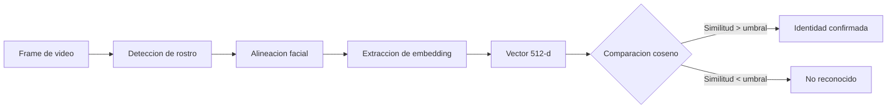
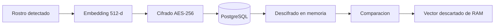

# Motor biometrico

El motor de reconocimiento facial es un **microservicio Python** que corre localmente en la misma maquina que la aplicacion WPF.

---

## Tecnologias

| Componente | Tecnologia | Funcion |
|---|---|---|
| Framework web | **FastAPI** | API REST asincrona de alto rendimiento |
| Motor facial | **InsightFace** (modelo `buffalo_l`) | Deteccion y embedding de rostros |
| Modelo de reconocimiento | **ArcFace** | Genera vectores de 512 dimensiones por rostro |
| Runtime ML | **ONNX Runtime** | Ejecucion eficiente de modelos |

## Como funciona el reconocimiento

### Paso a paso

1. **Deteccion**: localiza el rostro dentro del frame usando RetinaFace
2. **Alineacion**: normaliza la posicion, rotacion y escala del rostro
3. **Embedding**: genera un vector de 512 numeros decimales que representan las caracteristicas unicas del rostro
4. **Comparacion**: calcula la similitud coseno entre el vector generado y los vectores almacenados en la base de datos

## Seguridad de los datos biometricos

- Los embeddings se almacenan **cifrados con AES-256**
- Se descifran **solo en memoria** durante la comparacion
- Un embedding es un vector matematico: **no puede reconstruir un rostro**
- Si la base de datos es comprometida, los vectores cifrados son inutiles

## Gestion de recursos

El motor no esta siempre activo. El `FaceServiceManager` en la aplicacion WPF controla su ciclo de vida:

- **Inicio bajo demanda**: se activa cuando se necesita verificacion biometrica
- **Apagado por inactividad**: se detiene automaticamente tras un periodo sin uso
- **Consumo tipico**: ~300-500 MB de RAM cuando esta activo, 0 MB cuando esta dormido

## Endpoints de la API

| Metodo | Ruta | Funcion |
|---|---|---|
| `GET` | `/health` | Verificar que el servicio esta activo |
| `POST` | `/encode` | Generar embedding a partir de una imagen |
| `POST` | `/verify` | Comparar un frame contra embeddings almacenados |
