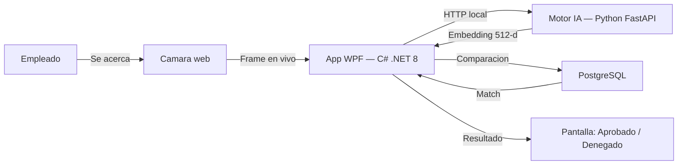

---
hide:
  - navigation
  - toc
---

# Control de Asistencia Biometrico

**Reconocimiento facial en tiempo real. 100% local. Sin internet.**

Un sistema de escritorio que registra la asistencia del personal mediante inteligencia artificial, sin almacenar fotografias, sin depender de la nube y con tiempos de respuesta inferiores a un segundo.

[Ver producto](producto/index.md){ .md-button .md-button--primary }
[Guia de instalacion](instalacion/index.md){ .md-button }

---

-   :material-lightning-bolt:{ .lg .middle } **Respuesta instantanea**

    ---

    El marcaje biometrico se completa en menos de **1 segundo**. Sin filas, sin contacto fisico, sin fricciones.

-   :material-shield-lock:{ .lg .middle } **Privacidad por diseno**

    ---

    Nunca se almacenan fotografias. Los rostros se convierten en vectores matematicos **cifrados con AES-256**, irreversibles ante cualquier ataque.

-   :material-wifi-off:{ .lg .middle } **100% offline**

    ---

    Opera exclusivamente en la red local de la empresa. No depende de internet, no envia datos a la nube, no tiene suscripciones.

-   :material-monitor-dashboard:{ .lg .middle } **Panel administrativo**

    ---

    Recursos Humanos gestiona empleados, horarios, tardanzas y reportes desde una interfaz moderna con soporte dark/light mode.

---

## Arquitectura del sistema

-   :material-language-csharp:{ .lg .middle } **Frontend nativo**

    ---

    WPF (.NET 8) con acceso directo al hardware de la camara via DirectShow. CPU al minimo (~1%).

-   :material-language-python:{ .lg .middle } **Motor biometrico**

    ---

    Microservicio FastAPI con InsightFace (ArcFace). Genera embeddings de 512 dimensiones por rostro.

-   :material-database:{ .lg .middle } **Base de datos**

    ---

    PostgreSQL con Entity Framework Core. Embeddings cifrados, auditoria completa, integridad referencial.

---

**RAMar Software Studio** — Innovacion, privacidad computacional y construccion de soluciones corporativas.

[:fontawesome-brands-github: Ver repositorio](https://github.com/ramarstudio/RAMar_Repo){ .md-button }

