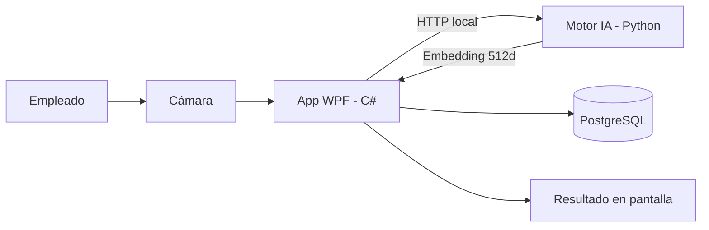

# Control de Asistencia Biométrico

El **Control de Asistencia Biométrico** es un sistema de escritorio que registra la entrada y salida del personal mediante reconocimiento facial. Opera 100% en la red local, sin internet y sin almacenar fotografías.

---

## Características

| Característica | Detalle |
|---|---|
| **Reconocimiento facial** | Identificación en menos de 1 segundo con InsightFace (ArcFace) |
| **Privacidad** | Cero fotos almacenadas — solo vectores matemáticos cifrados con AES-256 |
| **Sin internet** | Funciona completamente offline en la red local de la empresa |
| **Panel admin** | Dashboard, empleados, horarios, marcajes, reportes, auditoría |
| **Roles** | Empleado, Administrador, SuperAdministrador |
| **Configurable** | Tolerancia de tardanzas, horarios, parámetros del sistema |

---

## Stack tecnológico

| Componente | Tecnología |
|---|---|
| Aplicación de escritorio | C# .NET 8 (WPF) |
| Motor de reconocimiento facial | Python 3.13 + FastAPI + InsightFace |
| Base de datos | PostgreSQL + Entity Framework Core |
| Cifrado biométrico | AES-256 |
| Comunicación interna | HTTP localhost:8000 |

---

## Arquitectura

**Flujo de marcaje:**

1. El empleado se acerca a la cámara
2. La app WPF captura el frame y lo envía al motor Python
3. Python genera un embedding facial de 512 dimensiones
4. La app compara el embedding contra los registrados en PostgreSQL
5. Se muestra el resultado (aprobado/denegado) y se registra el marcaje

---

> **RAMar Software Studio** — Innovación, privacidad computacional y soluciones corporativas.
