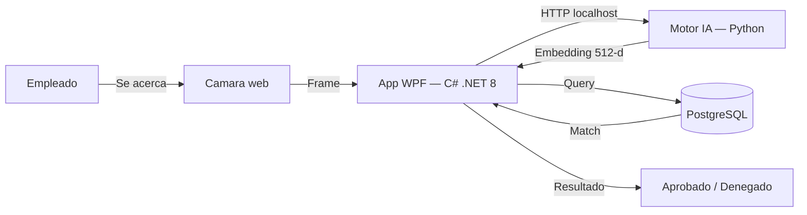

---
hide:
  - navigation
  - toc
---

  

    v1.0 — Produccion
    100% Offline
    C# .NET 8
    Python + IA
  

  <h1>Control de Asistencia Biometrico</h1>
  

    Reconocimiento facial en tiempo real, sin internet, sin fotografias almacenadas, con tiempos de respuesta menores a un segundo.
  

  <a href="producto/" class="md-button md-button--primary">Conocer el producto</a>
  <a href="instalacion/" class="md-button">Guia de instalacion</a>

  

    
&lt; 1s

    
Tiempo de marcaje

  

  

    
512-d

    
Vector facial

  

  

    
AES-256

    
Cifrado biometrico

  

  

    
0

    
Fotos almacenadas

  

---

Caracteristicas principales

## Por que este sistema

-   :material-lightning-bolt:{ .lg .middle } **Respuesta instantanea**

    ---

    El empleado se acerca a la camara y el sistema responde en milisegundos. Sin filas, sin contacto fisico, sin tarjetas.

-   :material-shield-lock:{ .lg .middle } **Privacidad por diseno**

    ---

    Nunca se almacenan fotografias. Los rostros se transforman en vectores matematicos cifrados con AES-256, completamente irreversibles.

-   :material-server-off:{ .lg .middle } **Sin dependencias externas**

    ---

    Opera en la red local. Sin internet, sin suscripciones cloud, sin enviar datos biometricos a terceros.

-   :material-monitor-dashboard:{ .lg .middle } **Panel de administracion**

    ---

    Dashboard con metricas en tiempo real, gestion de empleados, horarios, tardanzas, reportes y auditoria completa.

-   :material-brain:{ .lg .middle } **IA de alto rendimiento**

    ---

    Motor InsightFace (ArcFace) con 99.8% de precision. Se activa bajo demanda y libera RAM cuando no se usa.

-   :material-cog-outline:{ .lg .middle } **Configurable**

    ---

    Tolerancia de tardanzas, horarios por empleado, roles diferenciados y parametros del sistema ajustables por el admin.

---

Arquitectura

## Como esta construido

  C# .NET 8
  Python 3.13
  PostgreSQL
  FastAPI
  InsightFace
  AES-256
  Entity Framework Core

-   :material-desktop-classic:{ .lg .middle } **Frontend nativo (WPF)**

    ---

    Aplicacion de escritorio con acceso directo al hardware via DirectShow. CPU inferior al 1%.

-   :material-robot:{ .lg .middle } **Motor biometrico (Python)**

    ---

    Microservicio FastAPI con InsightFace. Embeddings de 512 dimensiones. Inicio bajo demanda.

-   :material-database-lock:{ .lg .middle } **Base de datos (PostgreSQL)**

    ---

    Embeddings cifrados, auditoria completa, integridad referencial via Entity Framework Core.

---

**RAMar Software Studio** — Innovacion, privacidad computacional y soluciones corporativas.

[:fontawesome-brands-github: Ver repositorio](https://github.com/ramarstudio/RAMar_Repo){ .md-button }

