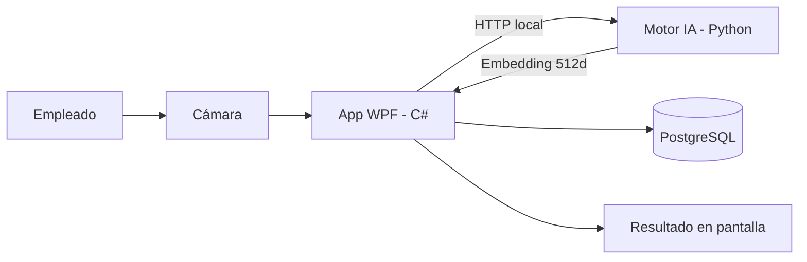

# RAMar Studio — Control de Asistencia Biométrico

El **RAMar Attendance System** es un ecosistema de escritorio diseñado para empresas que priorizan la eficiencia y la privacidad total. Mediante reconocimiento facial avanzado, permite registrar la entrada y salida del personal en menos de un segundo, operando **100% en red local** y sin almacenar fotografías de los empleados.

---

## ⚡ Instalación en un solo paso

Hemos simplificado drásticamente el despliegue. Ya no necesitas configurar archivos JSON ni entornos manuales.

[🚀 **¿Cómo empezar en 5 minutos?**](instalacion/guia.md){ .md-button .md-button--primary }
[⚙️ **Ver Requisitos previos**](instalacion/requisitos.md){ .md-button }

---

## 🛡️ Características clave

| Característica | Detalle |
|---|---|
| **Reconocimiento facial** | Identificación en menos de 1 segundo con **InsightFace (ArcFace)** |
| **Privacidad total** | Cero fotos almacenadas — solo vectores matemáticos cifrados con **AES-256** |
| **Sin internet** | Funciona completamente offline en la red local de la empresa |
| **Panel admin** | Gestión de empleados, horarios, marcajes, reportes y auditoría |
| **Multi-Rol** | Empleado, Administrador, RRHH, SuperAdministrador |

---

## 🧩 Stack tecnológico

| Componente | Tecnología |
|---|---|
| **Frontend/Core** | C# .NET 8 (WPF) |
| **Motor Facial** | **Python (Venv Aislado)** + FastAPI + InsightFace |
| **Base de Datos** | **PostgreSQL** + Entity Framework Core |
| **Cifrado** | **AES-256** para vectores biométricos |
| **Puerto local** | HTTP localhost:5001 |

---

## 🏗️ Arquitectura del Sistema

---

> **RAMar Software Studio** — Innovación, privacidad computacional y soluciones corporativas.
