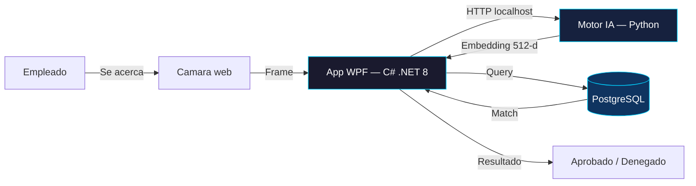

---
hide:
  - navigation
  - toc
---

:material-shield-check: v1.0 — Produccion
:material-wifi-off: 100% Offline
:material-language-csharp: .NET 8

# Control de Asistencia Biometrico

Reconocimiento facial en tiempo real, sin internet, sin fotografias almacenadas, con tiempos de respuesta menores a un segundo.

[Conocer el producto](producto/index.md){ .md-button .md-button--primary }
[Guia de instalacion](instalacion/index.md){ .md-button }

&lt; 1s

Tiempo de marcaje

512-d

Vector facial

AES-256

Cifrado biometrico

0

Fotos almacenadas

---

Caracteristicas principales

## Por que este sistema

:material-lightning-bolt:

### Respuesta instantanea

El empleado se acerca a la camara y el sistema responde en milisegundos. Sin filas, sin contacto fisico, sin tarjetas que olvidar.

:material-shield-lock:

### Privacidad por diseno

Nunca se almacenan fotografias. Los rostros se transforman en vectores matematicos cifrados con AES-256, completamente irreversibles.

:material-server-off:

### Sin dependencias externas

Opera exclusivamente en la red local. Sin internet, sin suscripciones cloud, sin enviar datos biometricos a terceros.

:material-monitor-dashboard:

### Panel de administracion

Dashboard con metricas en tiempo real, gestion de empleados, horarios, tardanzas, reportes exportables y auditoria completa.

:material-brain:

### IA de alto rendimiento

Motor InsightFace (ArcFace) con precision del 99.8%. Se activa bajo demanda y libera RAM cuando no se usa.

:material-cog-outline:

### Configurable por el admin

Tolerancia de tardanzas, horarios por empleado, roles diferenciados (Admin / SuperAdmin / Empleado) y parametros del sistema ajustables.

---

Arquitectura

## Como esta construido

:material-language-csharp: C# .NET 8
:material-language-python: Python 3.13
:material-database: PostgreSQL
:material-api: FastAPI
:material-eye: InsightFace
:material-lock: AES-256
:material-layers: Entity Framework Core

:material-desktop-classic:

### Frontend nativo (WPF)

Aplicacion de escritorio con acceso directo al hardware de la camara via DirectShow. Consumo de CPU inferior al 1%.

:material-robot:

### Motor biometrico (Python)

Microservicio FastAPI con InsightFace. Genera embeddings de 512 dimensiones. Se inicia solo cuando se necesita.

:material-database-lock:

### Base de datos (PostgreSQL)

Embeddings cifrados, auditoria completa, integridad referencial. Entity Framework Core para acceso seguro.

---

Desarrollado por

**RAMar Software Studio**

Innovacion, privacidad computacional y construccion de soluciones corporativas.

[:fontawesome-brands-github: Repositorio](https://github.com/ramarstudio/RAMar_Repo){ .md-button }

