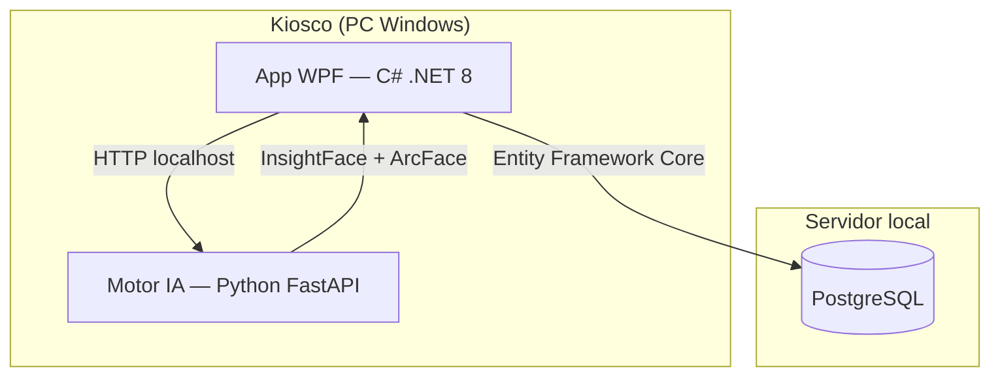
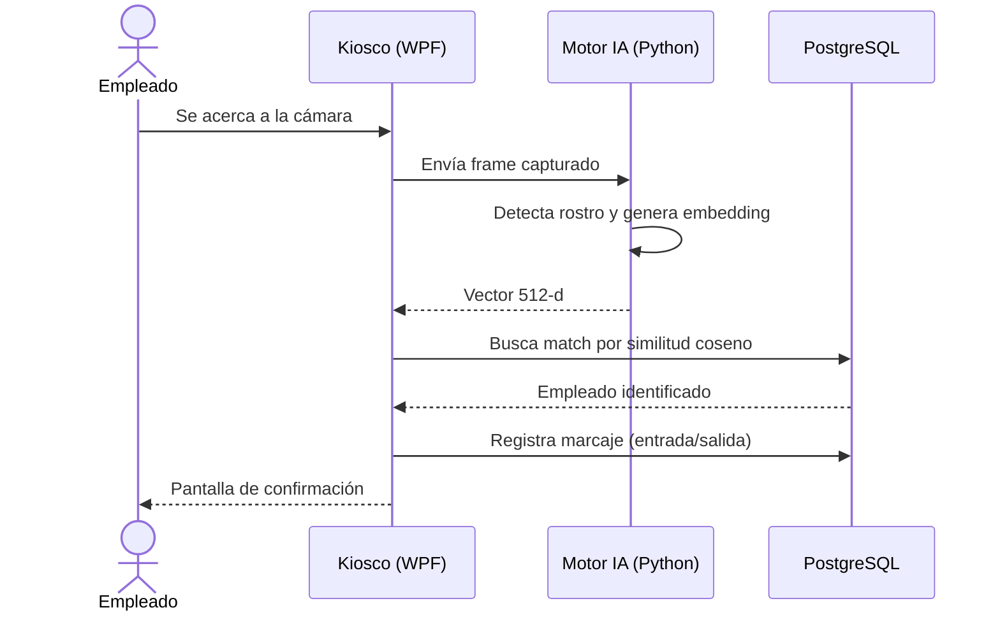

# Diagramas

Antes de escribir código, se mapearon las interacciones entre los actores del sistema y sus límites.

---

## Diagrama de casos de uso

Este diagrama define cómo cada actor de la empresa interactúa con el sistema, delimitando las capacidades de cada rol.

!!! note "Sobre el rol del empleado"
    El empleado opera en modo **pasivo-rápido**: solo se acerca a la cámara y recibe confirmación. No interactúa con teclados, botones ni menús.

---

## Diagrama de arquitectura

---

## Flujo de marcaje

