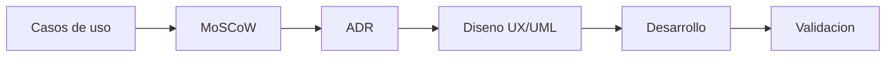

# Ingenieria de software

Proceso de desarrollo

Cada paso queda documentado formalmente antes de escribir codigo. Este enfoque previene desviaciones de alcance, sobrecostos y deuda tecnica.

---

Documentacion

## Contenido de esta seccion

-   :material-reload:{ .lg .middle } **Metodologia SDLC**

    ---

    Ciclo de vida y fases de produccion que garantizan calidad antes de codificar.

    [:octicons-arrow-right-24: Ver metodologia](metodologia.md)

-   :material-filter:{ .lg .middle } **Requisitos MoSCoW**

    ---

    Matriz de priorizacion: que se construye, que se descarta, y por que.

    [:octicons-arrow-right-24: Ver requisitos](requisitos.md)

-   :material-vector-polyline:{ .lg .middle } **Diagramas UML**

    ---

    Casos de uso, arquitectura y flujos de marcaje documentados visualmente.

    [:octicons-arrow-right-24: Ver diagramas](diagramas.md)

