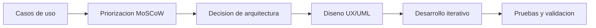

# Ingenieria de software

En esta seccion se documentan los procesos de ingenieria que preceden y acompanan al desarrollo del sistema.

---

## Proceso de desarrollo

Cada paso queda documentado formalmente antes de escribir una sola linea de codigo. Este enfoque previene desviaciones de alcance, sobrecostos y la acumulacion de deuda tecnica.

---

## Contenido de esta seccion

| Documento | Descripcion |
|---|---|
| [Metodologia SDLC](metodologia.md) | Ciclo de vida y fases de produccion |
| [Requisitos MoSCoW](requisitos.md) | Matriz de priorizacion de funcionalidades |
| [Diagramas UML](diagramas.md) | Diagramas de casos de uso y relaciones |
