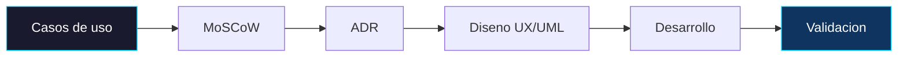

# Ingenieria de software

Proceso de desarrollo

Cada paso del desarrollo queda documentado formalmente antes de escribir codigo. Este enfoque previene desviaciones de alcance, sobrecostos y deuda tecnica.

---

Documentacion

## Contenido de esta seccion

:material-reload:

### Metodologia SDLC

Ciclo de vida y fases de produccion que garantizan calidad antes de codificar.

[Ver metodologia](metodologia.md){ .md-button }

:material-filter:

### Requisitos MoSCoW

Matriz de priorizacion: que se construye, que se descarta, y por que.

[Ver requisitos](requisitos.md){ .md-button }

:material-vector-polyline:

### Diagramas UML

Casos de uso, arquitectura y flujos de marcaje documentados visualmente.

[Ver diagramas](diagramas.md){ .md-button }

