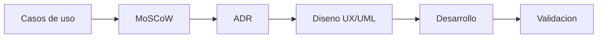

# Ingenieria de software

Cada paso del desarrollo queda documentado antes de escribir codigo.

---

## Documentos

| Documento | Descripcion |
|---|---|
| [Metodologia SDLC](metodologia.md) | Ciclo de vida y fases de produccion |
| [Requisitos MoSCoW](requisitos.md) | Matriz de priorizacion de funcionalidades |
| [Diagramas](diagramas.md) | Casos de uso, arquitectura y flujos |
