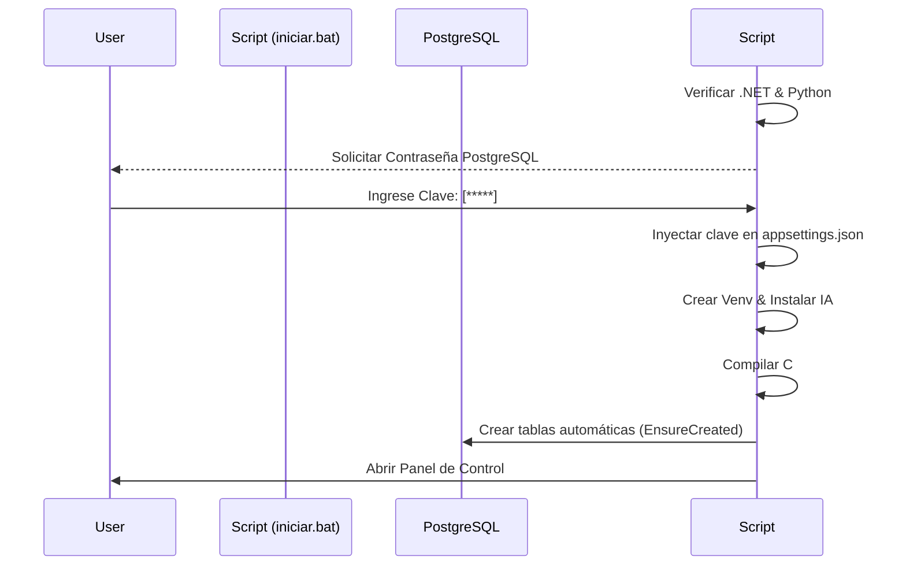

# Guía de Instalación (Zero-Touch)

La instalación de **RAMar Attendance System** ha sido diseñada para ser lo más cercana posible a un **"Siguiente, Siguiente, Siguiente"**.

---

## 1. Clonar el repositorio

Abre una terminal de Windows y ejecuta estos comandos:

```bash
git clone https://github.com/ramarstudio/RAMar_Repo.git
cd RAMar_Repo
```

---

## 2. Arrancar `iniciar.bat` (El asistente)

Navega hasta la carpeta descargada y busca el archivo **`iniciar.bat`**. Haz doble clic sobre él.

Aparecerá una ventana negra que realizará los siguientes pasos por ti:



---

## 3. ¿Qué pasa durante la primera ejecución?

La primera vez que el asistente ruede, verás los siguientes mensajes en la consola:

- **"Creando entorno virtual aislado (venv)"**: Aísla el motor de IA de tu sistema para no generar conflictos.
- **"Instalando librerías especializadas (InsightFace)"**: Descarga el motor de reconocimiento facial compatible con tu versión de Python.
- **"SISTEMA INICIANDO..."**: La app de escritorio (WPF) se abrirá automáticamente.

---

## 4. Primer inicio de sesión

Una vez abierta la interfaz, usa las credenciales maestras predefinidas:

| Campo | Valor |
|---|---|
| **Usuario** | `admin` |
| **Contraseña** | `admin123` |

!!! warning "Seguridad crìtica"
    **Cambia la contraseña inmediatamente** desde el panel para asegurar tu instancia.

---

### ❓ Preguntas frecuentes e intuitivas

- **¿Qué pasa si mi internet es lento?**
  El sistema descargará silenciosamente el motor de IA (~600MB) la primera vez que se use la cámara. Verás el panel de registro facial "cargando". Se paciente, solo ocurre una vez.
- **¿Puedo mover mi carpeta de lugar después de instalar?**
  Sí, pero asegúrate de siempre usar el archivo `iniciar.bat` para que el sistema actualice las rutas internas.
- **¿Cómo lo desinstalo?**
  Simplemente borra la carpeta del repositorio. No se instalan servicios pesados en Segundo Plano.
