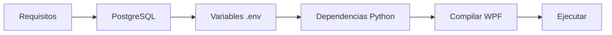

# Instalacion

Puesta en marcha

Todo lo necesario para desplegar el sistema de asistencia biometrico en una maquina Windows.

-   :material-clipboard-check:{ .lg .middle } **Requisitos previos**

    ---

    Software, hardware y puertos necesarios antes de comenzar.

    [:octicons-arrow-right-24: Ver requisitos](requisitos.md)

-   :material-rocket-launch:{ .lg .middle } **Guia paso a paso**

    ---

    Desde clonar el repositorio hasta el primer marcaje biometrico.

    [:octicons-arrow-right-24: Comenzar instalacion](guia.md)

---

Vista rapida

## Proceso de instalacion

| Paso | Tiempo estimado |
|---|---|
| Instalar requisitos previos | ~10 min |
| Configurar base de datos | ~5 min |
| Instalar dependencias Python | ~5 min |
| Primera ejecucion | ~2 min |
| **Total** | **~22 min** |
