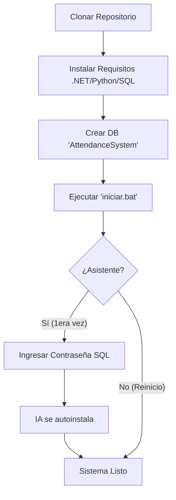

# Portal de Instalación (One-Click)

Bienvenido a la guía acelerada de despliegue de **RAMar Attendance System**. Hemos simplificado el proceso para que cualquier persona pueda arrancar el proyecto en su máquina local sin necesidad de realizar configuraciones manuales complejas.

---

## ⚡ Filosofía de instalación

Nuestra estrategia se basa en la **automatización total**. Hemos eliminado los pasos manuales de configuración de archivos JSON y entornos virtuales.

---

## 🧭 ¿Qué ruta prefieres?

| Sección | Descripción | Esfuerzo |
|---|---|---|
| **[Requisitos previos](requisitos.md)** | Lo mínimo absoluto antes de empezar. | 2 min |
| **[Guía Paso a Paso](guia.md)** | El asistente inteligente `iniciar.bat`. | 3 min |
| **[Configuración Manual](../arquitectura/motor-biometrico.md)** | Para desarrolladores que quieren ver el motor. | 10 min |

---

!!! tip "Dica de Oro"
    Si estás instalando en una máquina con poco internet, el primer arranque puede tardar unos **2 minutos** mientras el sistema descarga los modelos de IA facial automáticamente. No cierres la ventana negra hasta ver el panel de control.
