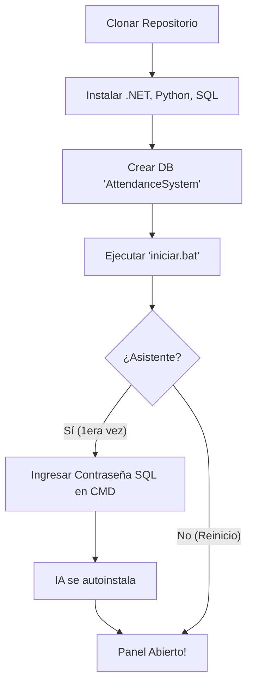

# Portal de Instalación (Zero-Touch) 🚀

Bienvenido al sistema de despliegue acelerado de **RAMar Studio**. Hemos simplificado el proceso para que cualquier persona pueda arrancar el proyecto en su máquina local en menos de una canción.

---

## 🧭 ¿Qué ruta prefieres?

| Fase | Título | Esfuerzo |
| :--- | :--- | :--- |
| **Paso 1** | **[Requisitos previos](requisitos.md)** | 2 min |
| **Paso 2** | **[Guía Paso a Paso (La más rápida)](guia.md)** | 3 min |
| **Ref** | **[Configuración Manual](../arquitectura/motor-biometrico.md)** | 10 min |

---

## ⚡ El Asistente Inteligente (`iniciar.bat`)

Nuestra estrategia se basa en la **automatización total**. Hemos eliminado los pasos manuales de configuración de archivos JSON y entornos virtuales.

---

!!! success "Listo en menos de 5 minutos"
    Si ya tienes instalados .NET, Python y PostgreSQL, solo necesitas ejecutar el archivo `iniciar.bat`. No hace falta que abras el código fuente para configurar nada.

---

### 🔍 ¿Qué es el despliegue Zero-Touch?
Es nuestra filosofía de diseño donde el usuario **no toca ningún archivo de configuración**. El sistema es lo suficientemente inteligente para pedirte lo que necesita por consola y configurarse solo.
