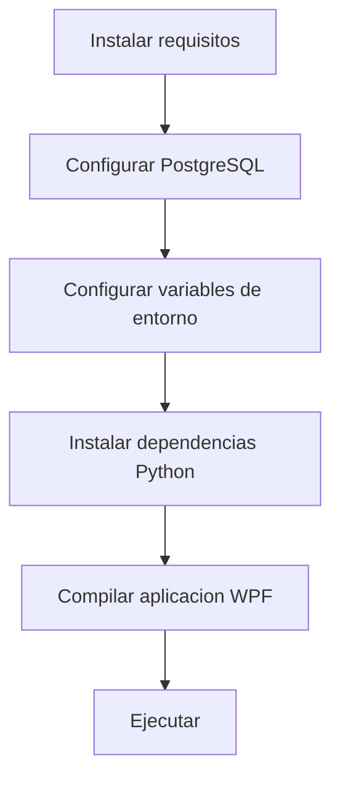

# Guia de instalacion

Esta seccion describe como preparar el entorno y poner en marcha el sistema de asistencia biometrico.

---

## Vista rapida

| Paso | Tiempo estimado |
|---|---|
| Requisitos previos | 10 min |
| Configuracion de base de datos | 5 min |
| Instalacion de dependencias | 5 min |
| Primera ejecucion | 2 min |

---

Comienza con [Requisitos previos](requisitos.md) y luego sigue la [Guia paso a paso](guia.md).
