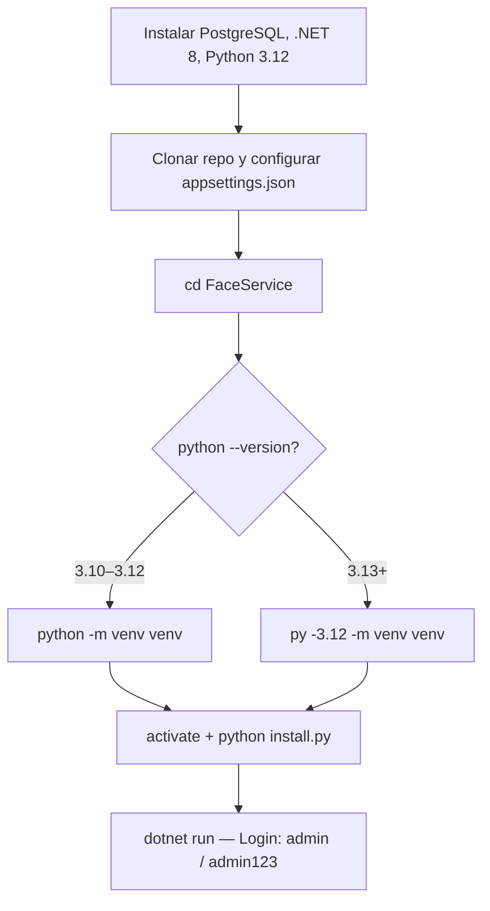

# Instalación

Elige la ruta según tu perfil.

---

## ¿Cuál es tu caso?

=== "Soy usuario final o administrador"

    Solo quiero instalar el sistema y usarlo. No me interesa el código.

    **Tiempo estimado: 10–15 minutos (la primera vez)**

    1. Lee los [requisitos del equipo](requisitos.md)
    2. Sigue la [guía paso a paso — Usuario](guia.md#guia-usuario)

=== "Soy técnico o desarrollador"

    Quiero desplegar, configurar o modificar el sistema.

    **Tiempo estimado: 5–10 minutos**

    1. Revisa los [requisitos técnicos](requisitos.md)
    2. Sigue la [guía técnica](guia.md#guia-tecnica)

---

## Resumen del proceso

---

!!! info "Instalación por comandos"
    Toda la instalación se realiza por terminal. Consulta la [guía paso a paso](guia.md) para los comandos exactos.
