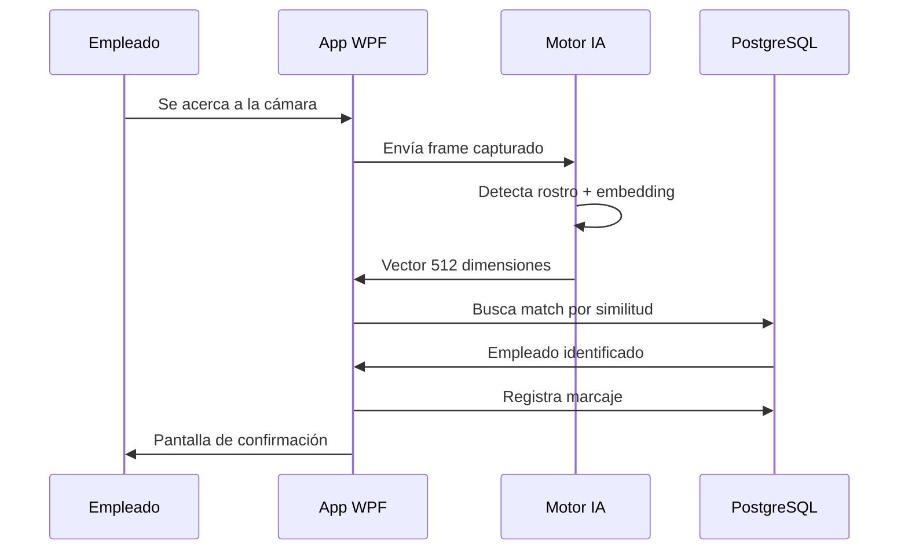
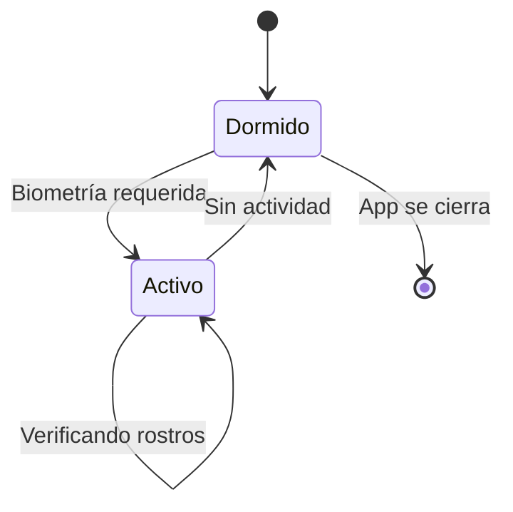

# Cómo funciona

## Flujo de marcaje

El proceso completo toma menos de **1 segundo**.

---

## Registro de empleados

Antes de marcar asistencia, un administrador registra el rostro de cada empleado:

1. El admin selecciona al empleado desde el panel
2. Se activa la cámara en vivo
3. El empleado se posiciona frente a la cámara
4. El admin hace clic en **Capturar rostro**
5. El sistema genera un embedding y lo almacena cifrado

---

## Tipos de marcaje

| Tipo | Descripción |
|---|---|
| **Entrada** | Ingreso al inicio de la jornada |
| **Salida** | Salida al finalizar la jornada |
| **Break inicio** | Inicio de pausa o receso |
| **Break fin** | Fin de la pausa |

El sistema detecta **tardanzas** automáticamente comparando la hora de marcaje con el horario asignado al empleado.

---

## Gestión de recursos

El motor de IA **no está siempre activo**. Se inicia cuando se necesita y se detiene por inactividad:

| Estado | RAM | CPU |
|---|---|---|
| Dormido | 0 MB | 0% |
| Activo | ~300-500 MB | < 5% por verificación |
