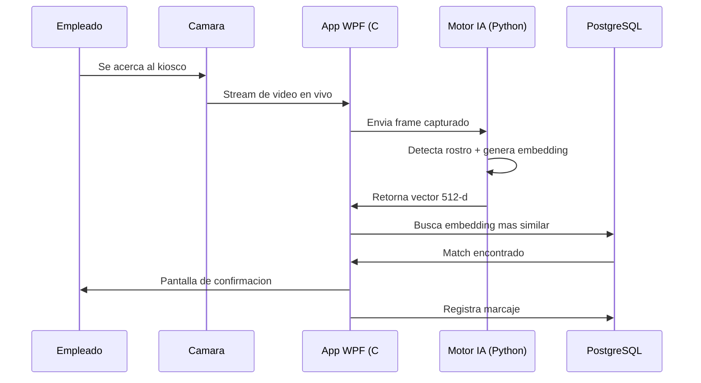
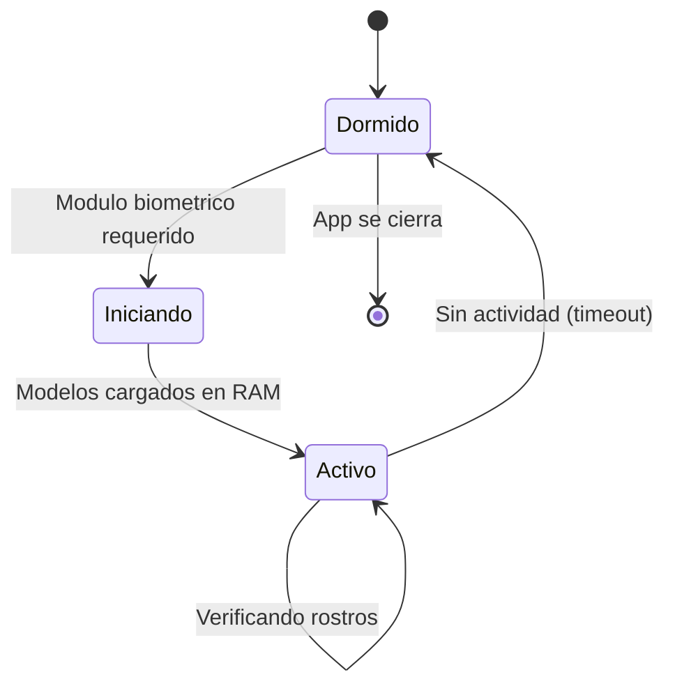

# Como funciona

Flujo principal

## Marcaje de asistencia

!!! tip "Rendimiento"
    El proceso completo — desde la captura del frame hasta la confirmacion en pantalla — toma menos de **1 segundo**.

---

Proceso inicial

## Registro de empleados

Antes de marcar asistencia, un administrador registra el rostro de cada empleado:

<ul class="step-list">
<li>El admin selecciona al empleado desde el panel</li>
<li>Se activa la camara en vivo</li>
<li>El empleado se posiciona frente a la camara</li>
<li>El admin hace clic en <strong>Capturar rostro</strong></li>
<li>El sistema genera un embedding y lo almacena cifrado</li>
</ul>

A partir de ese momento, el empleado puede marcar asistencia con su rostro.

---

Eventos

## Tipos de marcaje

| Tipo | Descripcion | Icono |
|---|---|---|
| **Entrada** | Ingreso al inicio de la jornada | :material-login: |
| **Salida** | Salida al finalizar la jornada | :material-logout: |
| **Break inicio** | Inicio de una pausa o receso | :material-coffee: |
| **Break fin** | Fin de la pausa | :material-coffee-off: |

El sistema detecta automaticamente **tardanzas** comparando la hora de marcaje contra el horario asignado, aplicando los minutos de tolerancia configurados por el admin.

---

Eficiencia

## Gestion de recursos

El motor de inteligencia artificial **no esta siempre activo**. Se inicia automaticamente cuando se necesita y se detiene tras un periodo de inactividad.

| Estado | RAM consumida | CPU |
|---|---|---|
| **Dormido** | 0 MB | 0% |
| **Activo** | ~300-500 MB | < 5% por verificacion |
