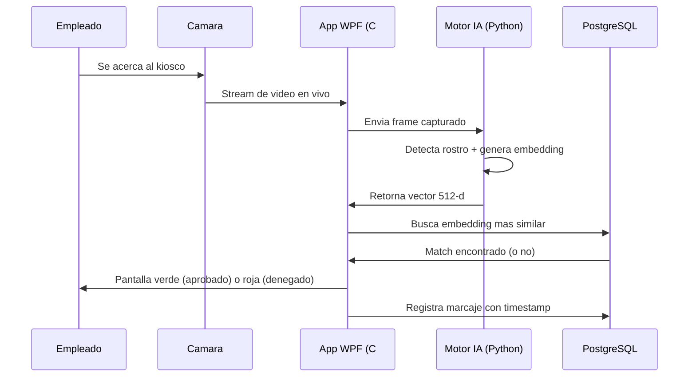
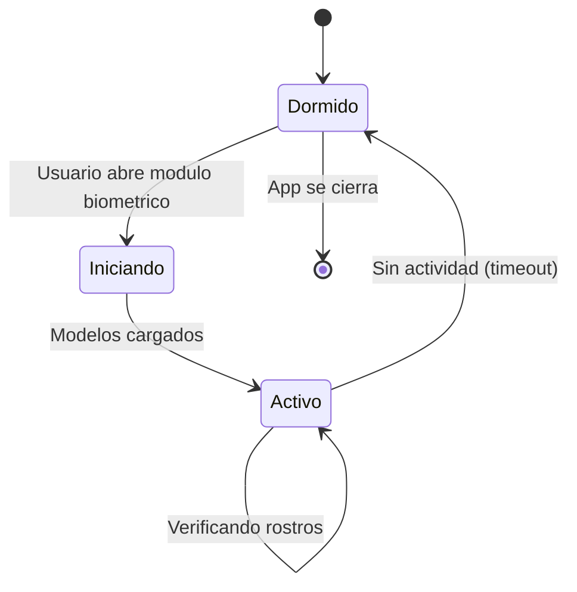

# Como funciona

## Flujo de marcaje

El proceso completo toma menos de **1 segundo**.

---

## Registro de empleados

Antes de que un empleado pueda marcar asistencia, un administrador debe registrar su rostro:

1. El admin selecciona al empleado desde el panel
2. Se activa la camara en vivo
3. El empleado se posiciona frente a la camara
4. El admin captura el rostro
5. El sistema genera un embedding biometrico y lo almacena cifrado

A partir de ese momento, el empleado puede marcar asistencia con su rostro.

---

## Tipos de marcaje

| Tipo | Descripcion |
|---|---|
| **Entrada** | Registro de ingreso al inicio de la jornada |
| **Salida** | Registro de salida al finalizar la jornada |
| **Break inicio** | Inicio de una pausa o receso |
| **Break fin** | Fin de la pausa |

El sistema detecta automaticamente **tardanzas** comparando la hora de marcaje con el horario asignado al empleado, aplicando los minutos de tolerancia configurados.

---

## Gestion de recursos

El motor de inteligencia artificial (Python) **no esta siempre activo**. La aplicacion WPF lo inicia automaticamente cuando se necesita y lo detiene cuando no hay actividad, liberando RAM y CPU.

